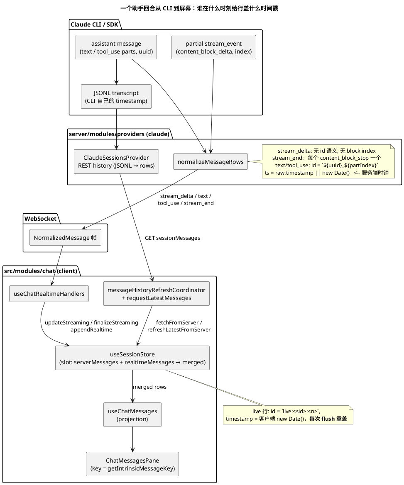
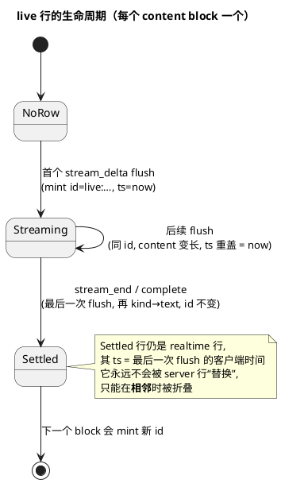
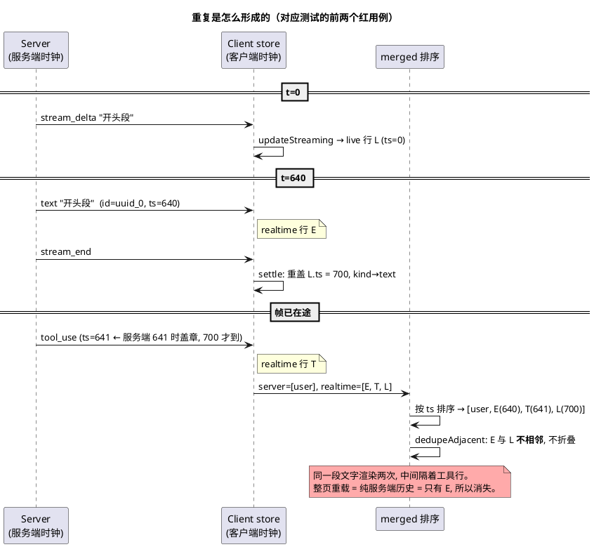

# 增量输出的助手文本被渲染两次：流式行与服务端回声的对账设计

- 状态：analysis（只分析与讨论，未改业务代码）
- 日期：2026-10-01
- 关联：`src/modules/chat/hooks/useSessionStore.ts`、`src/modules/chat/hooks/useChatRealtimeHandlers.ts`、`src/modules/chat/utils/liveRowIdentity.ts`、`server/modules/providers/list/claude/claude-sessions.provider.ts`
- 复现测试：`src/modules/chat/tests/echoSeparatedByToolRow.test.tsx`（3 红 2 绿）
- 前序修复：`6a5901a7`（任务 `gap-chat-dedupe-missing-text-to-stream-delta-adjacency`），只补了“回声紧挨着流式行”的相邻形态

> 图用 PlantUML 写成。本机没有 PlantUML 渲染器，**图没有渲染校验过**，只按语法自查；提交前请在能渲染的环境里过一遍。

---

## 1. 现象与已验证的事实

在 `:3001` 上用浏览器做的验证（新建会话，让模型“说一句 → 跑 Bash → 再说一句”）：

- 回合进行中，第一段文字出现两次：一行带 `Claude` 标签和时间戳（服务端行），一行没有时间戳（客户端流式行）。回合结束后仍在，**整页重载即消失**。
- 4 次连续新会话里 2 次出现；在“流式中切走 35 秒再切回”的 2 次里 1 次出现，且重复行落在**两个工具行之间**，把本该合成一组的 `Bash x2` 拆开。
- 帧序（抓自 WebSocket）：`stream_delta… → text → status → stream_end → tool_use → … → tool_result → stream_delta… → text → stream_end → complete`。
- 重复的轮次里，首段 `stream_delta` 与 `text` 帧相隔约 540–640 ms；不重复的轮次里相隔 0–95 ms。

在测试里把时间戳固定后确认：触发需要**两个条件同时成立**。

1. slot 里已经有服务端行（通常是已落盘的 prompt 行）。服务端行为空时 `computeMerged` 直接按到达顺序合并、不排序，两行天然相邻，问题不会出现。
2. 工具行的时间戳早于客户端结算（settle）流式行的时间。

---

## 2. 现有架构

### 2.1 端到端的数据通路



### 2.2 客户端 store 内部：一个回复有两种表示

```plantuml
@startuml
title useSessionStore：同一个回复的两种表示，以及三处各自为政的对账规则

class SessionSlot {
  serverMessages: NormalizedMessage[]   -- REST 历史, 以 JSONL 时间戳为准
  realtimeMessages: NormalizedMessage[] -- WS 帧 + 客户端自造的 live 行
  merged: NormalizedMessage[]
}

class "live 行" as Live {
  id = live:<sid>:<n>
  kind = stream_delta → (settle) → text
  timestamp = 客户端时钟, 每次 flush 重盖
  content = 本回合累计文本
}
class "服务端文本行" as Echo {
  id = `<uuid>_<partIndex>`
  kind = text
  timestamp = 服务端帧时钟 / JSONL 时钟
}

SessionSlot o-- Live
SessionSlot o-- Echo

package "对账规则 (全部以“文本相等”为判据)" {
  class computeMerged {
    1. 去掉 id 已在 server 里的 realtime 行
    2. 若 server 为空: 按到达顺序, 不排序
    3. 否则 [server + extra] 按 timestamp 稳定排序
    4. dedupeAdjacentAssistantEchoes
  }
  class dedupeAdjacentAssistantEchoes {
    只折叠**相邻**的:
    (stream_delta,text) (text,stream_delta) (text,text)
    存活者 = 客户端 live 行 (为了 React key 稳定)
  }
  class pruneRealtimeSupersededByServer {
    刷新后丢弃 server 已拥有的 realtime 行
    **有意保留 live 行** (带该回合 key)
  }
  class isAssistantTextEchoedInSameTurnOnServer {
    “同一回合内 server 有同文本行” (按 user 回合序号定位)
    **只对非 live 行生效**
  }
}

computeMerged --> dedupeAdjacentAssistantEchoes
pruneRealtimeSupersededByServer --> isAssistantTextEchoedInSameTurnOnServer
Live ..> dedupeAdjacentAssistantEchoes : 只有相邻才被折叠
Live ..> pruneRealtimeSupersededByServer : 被豁免
@enduml
```

### 2.3 流式回合的状态机（客户端视角）



---

## 3. 缺陷的机理



核心不是某个 `if` 写漏了，而是三件事叠在一起：

1. **同一回复有两个身份**：流式的 `live:…` 与落盘的 `<uuid>_<n>`，两者之间没有任何结构化联系，只能靠“文本相等”去猜。
2. **排序键混用两个时钟**：live 行用客户端时钟且每次 flush 重盖；其余行用服务端/JSONL 时钟。重盖后 live 行“越来越新”，必然被排到同回合后续行之后。
3. **折叠规则假设相邻**：而相邻性恰恰是被 (2) 破坏的东西。

另外两个放大因素：

- 刷新路径护栏不一致：`requestLatestMessages`（切回会话、WS 重连）没有 `isProcessing` 护栏，而它的姊妹路径有，所以回合进行中也会把服务端行拉进来（前序任务已指出）。
- `stream_end` 在服务端是**每个 content_block_stop** 发一个（含 tool_use 块），客户端因此对同一回合多次 settle；目前无害，但说明 `stream_end` 不是“回合结束”，也不携带“结算的是哪一块”。

---

## 4. 改进方案

按“治本程度”由低到高，四个方案**不互斥**。

### 方案 A：把折叠从“相邻”放宽到“同一回合内的一对一匹配”（最小改动）

- 在 `dedupeAdjacentAssistantEchoes` 之外，加一轮按回合分段（以 user 行为界）的匹配：同回合内，带 live id 的助手 `text`/`stream_delta` 行与更早的、非 live 的同文本助手 `text` 行**配对一次**；折叠后行取**回声的位置**、**live 行的 id**（key 不变，位置也不漂）。
- 必须“一对一、用掉即止”：同一回合里模型确实两次说出相同的话（例如两次 `OK`）时，不能把两个都吞掉。
- 优点：改动局部，直接让 3 个红用例变绿；不碰协议。
- 缺点：仍然是文本相等的启发式；对“文本被后处理过、两边不完全相等”的情形无能为力；规则继续增殖（目前已有三处）。

### 方案 B：让 live 行的排序键与服务端同源，且不再每次重盖

- live 行的时间戳取**首个 `stream_delta` 帧自带的服务端时间戳**，之后 flush 不再重盖。
- 流式一定先于该块的最终 `text` 与其后的 `tool_use`，所以 live 行永远排在回声**之前**：顺序变成 `[live, echo, tool]`，落进已有的 `(stream_delta, text)` 相邻规则，不需要新增折叠规则。
- 优点：把“跨时钟比较”这个根因拿掉，改动很小；对切回、刷新路径同样成立。
- 风险与待确认：
  - 为什么当初要每次重盖（`updateStreaming` 里的 `timestamp: new Date()`）？`git log -S` 只追到 `99ea0525`，没有找到明确理由；改前需要一个断言“live 行不会排到自己的 prompt 行之前”的测试。
  - 服务端 JSONL 时间戳与帧时间戳并非同一次取值，毫秒到秒级的偏差理论上仍可能让 `[echo, live]` 颠倒；所以 B 适合作为 A 的**前置收敛**，而不是唯一手段。

### 方案 C：给流式帧和最终行一个共同的结构化身份（治本，需改协议）

- `content_block_delta` 事件自带 `index`，`message_start` 带 `message.id`（见 `claude-stream-event-unwrap.test.ts` 的夹具）。服务端 normalizer 目前把这两个信息都丢了，只取 `delta.text`。
- 给 `stream_delta` / `stream_end` 附 `blockKey = <message.id>:<index>`，并让随后的 `text` 行带同一个 `blockKey`（最终 assistant 消息的 `message.id` 是否等于 `message_start` 里的 id，**我没有用捕获的真实帧确认**，需要先抓一帧验证；若不等，退而用“同回合内第 n 个 text block”的序号）。
- 客户端 settle 时**不再“把 live 行翻成 text”**，而是用 `blockKey` 找到 live 行，由规范的 `text` 行**替换**它，同时把 live 行的 id 作为 `renderKey` 传给新行。
- 把“数据身份”和“渲染 key”拆开：`ChatMessagesPane` 的 key 取 `renderKey ?? id`。这样“为了 key 稳定必须让客户端行当存活者”这个约束消失，对账就不必再保留客户端行、也不必再比较文本。
- 优点：消灭整类“相等文本”启发式；对“服务端文本经过后处理”“相同文本出现两次”都正确；`stream_end` 终于能说清“结算的是哪一块”。
- 代价：服务端 + 共享类型 + 客户端 + 其它 provider（opencode/cursor 也产出 `stream_delta`）都要对齐；需要为没有 `blockKey` 的 provider 保留降级路径（方案 A/B 恰好充当降级）。

### 方案 D：流式文本不进入 `merged`，作为“尾部叠加层”渲染

- 流式中的文本只是 transcript 末尾的一个叠加层，不参与排序、不参与对账；该块的规范 `text` 行（按 `blockKey` 或序号）到达时叠加层消失，规范行占位。
- 优点：排序和折叠问题**整个不存在**；“流式一定在尾部”本来就是真实语义。
- 代价：需要重写 live 行的渲染与 key 稳定逻辑（`183b2bac`、`13e3e8e7` 这批为保持 key 稳定做的工作要重来），改动面最大；也要处理“叠加层与规范行同帧交接”的视觉连续性。

### 建议

1. **先做 A**（带一对一约束）并保留现有的 3 个红测试作为验收——它是止血，且风险最低。
2. **同时评估 B**：先补“live 行不排到自己 prompt 之前”的测试，再决定是否停止每次 flush 重盖；B 如果成立，A 的新增规则大多会变成兜底。
3. **C 作为中期方案单独立项**，先做一次真实帧抓取，确认 `message.id`/`index` 能否稳定连接流式与最终行；确认后再写协议提案。D 只在 C 做完仍觉得 live 行逻辑过重时再考虑。

---

## 5. 测试策略

- 保留并扩展 `echoSeparatedByToolRow.test.tsx`：它在 store 层固定 `Date`，每个用例只陈述一个排序。
- 缺的一层是**序列/性质测试**：随机生成“帧到达顺序 × 服务端/客户端时间偏差 × 刷新插入点”，对每个序列断言：
  - 任一回合内，同一 block 的文本只渲染一次；
  - 同一回合内真正重复的两段相同文本仍是两行；
  - settle 前后同一 block 的渲染 key 不变（对应 `liveRowIdentity.test.tsx` 的意图）。
- 服务端侧补一条：同一条 assistant 消息拆出的 `text` 与 `tool_use` 帧，时间戳不得倒序（本次推断的前提之一，目前只靠帧抓取旁证）。

## 6. 未验证 / 未决事项

- 图未经 PlantUML 渲染。
- “工具行时间戳早于客户端结算时间”这一前提来自帧抓取与合并行为的推断，没有单独的服务端断言。
- `message_start.message.id` 与最终 assistant 消息 `message.id` 是否一致，未用真实帧核实（方案 C 的前置）。
- 每次 flush 重盖时间戳的历史原因未查明（方案 B 的前置）。
