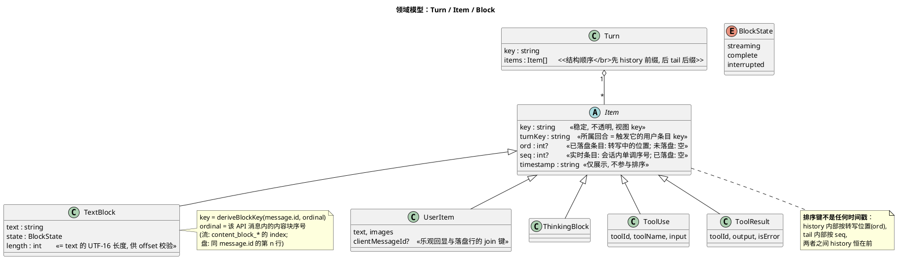
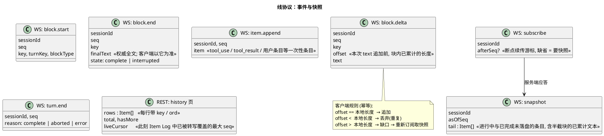
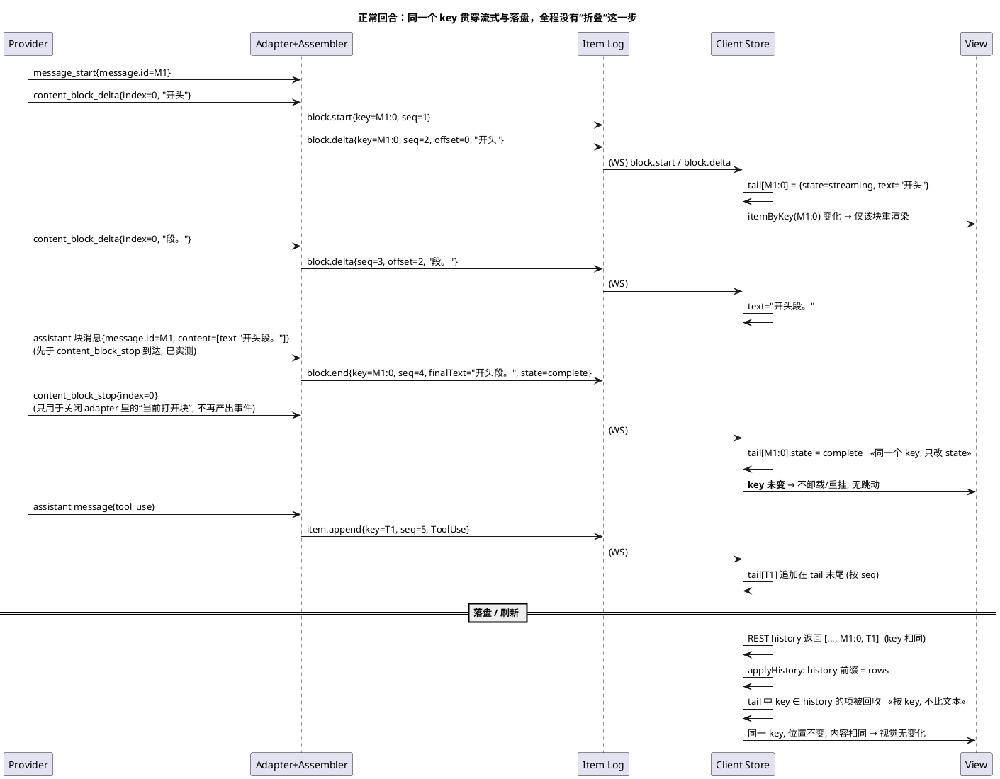
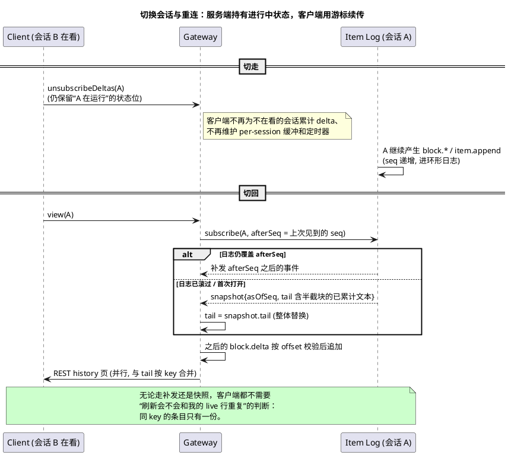
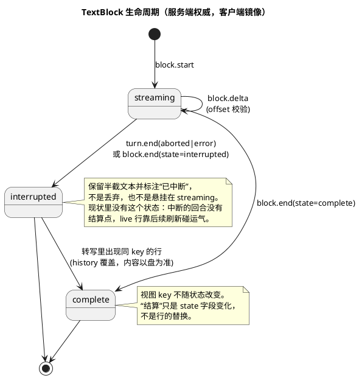
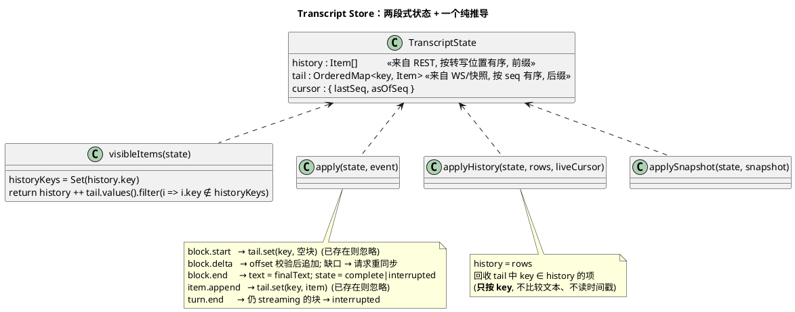
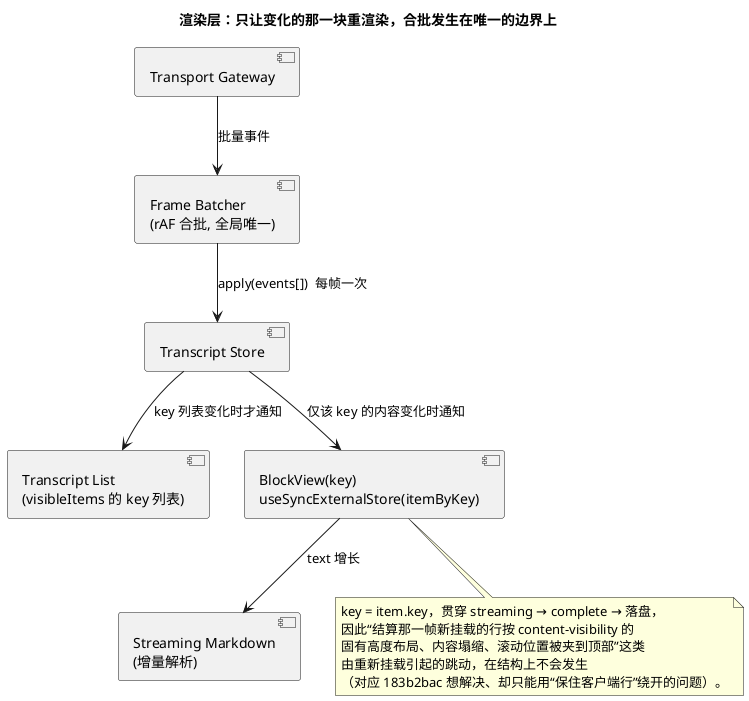
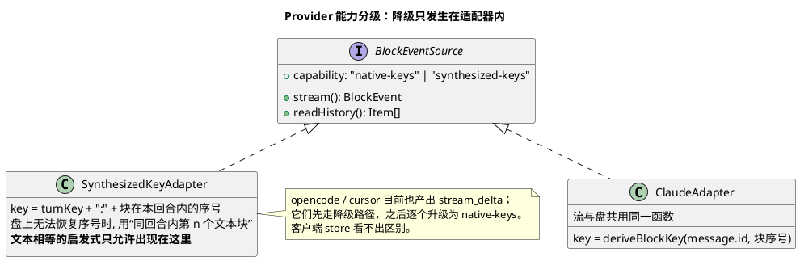

# 助手文本增量输出：目标架构（单一身份 · 结构化顺序 · 幂等归约）

- 状态：design（只做架构设计，不含实现；与 `chat-live-row-reconciliation.md` 配套，后者分析现状缺陷）
- 日期：2026-10-01
- 范围：Claude 路径为主（resident 与 per-run 同一 normalizer）；opencode / cursor 以“能力降级”接入（见 §8）

> 图用 PlantUML。本机无渲染器，**图未渲染校验**，提交前请在能渲染的环境里过一遍。

---

## 0. 一句话

**一个内容块只有一个实体。** 流式中和落盘后只是同一个 `key` 的两种状态；顺序由结构（先后位置）决定，不由时钟决定；客户端只做对 `key` 幂等的归约，不再有“对账”。

现状的缺陷（同一段文字渲染两次）不是某条规则漏写，而是下面三件事同时成立：同一回复有两个互不关联的身份；排序混用两个时钟；折叠规则依赖相邻性。目标架构把这三件事在**结构上**消除，而不是再加规则。

---

## 1. 设计原则（可检验的不变量）

| # | 不变量 | 违反时的症状（现状里对应的） |
|---|---|---|
| I1 | **一块一实体**：流式状态与落盘状态是同一个 `key` 的两个状态，不是两行 | live 行与服务端行并存，靠文本相等去折叠 |
| I2 | **身份由生产者给出，客户端只当不透明字符串**：服务端内容的 `key` 不由客户端铸造（客户端只为自己的乐观输入铸 key，并随请求带给服务端） | 客户端铸 `live:<sid>:<n>`，与服务端 id 无联系 |
| I3 | **顺序是结构性的，不是时间性的**：已落盘行是会话条目序列的**前缀**，未落盘条目是**后缀**；时间戳只用于展示 | 两个时钟混排，live 行每次 flush 重盖，被排到工具行之后 |
| I4 | **归约幂等且可检测缺口**：事件带 `key + seq + offset`，重复/乱序可识别，缺口触发重同步 | 刷新与 WS 帧各自成路，互相重叠 |
| I5 | **服务端持有进行中状态**：快照包含半截块的已累计文本；订阅带游标 | 客户端自己缓冲、自己累计、切走再切回靠 stale 刷新碰运气 |
| I6 | **视图 key = 实体 key**：视图层看不见“结算”，只看见一个 prop（`state`）的变化 | 为保 React key 稳定，被迫“客户端行当存活者” |
| I7 | **文本相等启发式只允许存在于降级适配器内**，store 与视图里零处 | 三处规则（相邻折叠 / prune / 同回合回声）都以文本相等为判据 |

I3 的前提（**已落盘行是前缀**）依据：CLI 按流顺序逐块追加 JSONL，所以任何时刻落盘的集合都是流顺序的前缀。破坏该前提的情形见 §10。

---

## 2. 目标分层

```plantuml
@startuml
title 目标架构：分层与职责（箭头 = 数据流向）

skinparam componentStyle rectangle
skinparam defaultTextAlignment center

package "Provider（Claude CLI / SDK 等）" as P {
  [stream_event\nmessage_start{message.id}\ncontent_block_{start,delta,stop}{index}] as SE
  [assistant message\n(message.id, content[])] as AM
  [JSONL 转写\n每个内容块一行\n同 message.id, 不同 uuid] as JL
}

package "服务端 server/modules/providers" as S {
  [Provider Adapter\n(每个 provider 一个)\n**唯一**派生 key 的地方] as AD
  [Turn Assembler\n累计进行中块的文本\n分配 seq / offset] as TA
  [Session Item Log\n内存环形日志: (seq → 事件)\n+ 进行中块快照] as LOG
  [History Reader\nJSONL → Item[]\n同一个 key 派生函数] as HR
}

package "传输" as T {
  [WS: chat 事件流\nsubscribe(session, afterSeq)] as WS
  [REST: history 页\n+ liveCursor] as REST
}

package "客户端 src/modules/chat" as C {
  [Transport Gateway\n唯一入口: 校验 seq/offset\n按动画帧合批] as GW
  [Transcript Store\n纯归约: history + tail] as ST
  [Selectors\nvisibleItems()\nitemByKey(key)] as SEL
  [Transcript View\nkey = item.key] as VIEW
}

SE --> AD
AM --> AD
JL --> HR
AD --> TA : BlockEvent
TA --> LOG : 带 seq 的事件
LOG --> WS : 实时 + 订阅时补发
HR --> REST
WS --> GW
REST --> GW
GW --> ST : apply(event) / applyHistory(rows)
ST --> SEL
SEL --> VIEW

note bottom of AD
  key 的派生规则只在这里（流）和 History Reader（盘）各一份,
  且共用同一个函数 deriveBlockKey(messageId, ordinal)
end note
note bottom of ST
  不排序、不比较文本、不读时钟
end note
@enduml
```

关键边界：

- **派生 key 的函数只有一个**（`deriveBlockKey`），流路径与盘路径共用，所以“两个身份”在源头就不可能出现。
- **进行中状态在服务端**（Turn Assembler + Item Log）。客户端不再自己累计 delta，不需要每个会话一个缓冲/定时器。
- **客户端只有一个入口**（Gateway），归约是纯函数，便于性质测试。

---

## 3. 领域模型



> 已核实（2026-10-01，用 `@anthropic-ai/claude-agent-sdk` 0.3.165 以 `includePartialMessages` 真实跑一次“thinking → 文本 → Bash → 文本”，再对照它写出的 JSONL；见 §10.1）：
> - `message_start.message.id` ＝ SDK `assistant` 消息的 `message.id` ＝ JSONL 的 `message.id`，三处恒等。
> - 一条 API 消息被拆成多行 JSONL，每行一个内容块；流里的 `index`（0 thinking、1 text、2 tool_use）与“同 `message.id` 的第 n 行”一致。
> - SDK 发出的每个块级 `assistant` 消息的 `uuid` ＝ 该块 JSONL 行的 `uuid`（所以现有 `text` 帧 id `uuid_0` 与落盘 id 本来就相等）；**而 `stream_event` 帧没有任何可与之关联的 id**，这正是流式行只能靠文本相等去猜的根源。
> - 同一消息内相邻块的 JSONL 时间戳相差 ~100–400 ms（10:07:13.610 / .997 / 14.274），与流到达时刻无关，不能当 join 键。

---

## 4. 线协议

> **状态：暂缓（2026-10-01 裁定）。** 本节的 `seq` / `offset` / 订阅 / 快照协议不会现在实施：没有观察到必须靠它们才能解决的失败（重复渲染已由 `blockKey` 结构性消除，见 §11.1），且 §11.3 的 4 个决定尚未裁定。唯一已验证、已单独立项的协议问题是游标跨 run 错位，见任务 `gap-chat-subscribe-cursor-needs-run-identity`。出现实证后再回到本节。



要点：

- `block.end.finalText` 是**权威全文**，客户端不必相信自己累计的结果；累计与权威不一致只会被静默纠正，不会产生第二行。
- `offset` 使重复/乱序帧可检测；`seq` 使“哪些事件我已经见过”可检测，断线重连只需 `afterSeq`。
- `turn.end` 把仍在 `streaming` 的块置为 `interrupted`（保留半截文本），不丢也不悬挂。

---

## 5. 时序：一个“说话 → 工具 → 说话”的回合



**用现有失败测试对照**：旧模型里 `E1(服务端文本) · T(工具) · L(live)` 是三个 key 不同的行；新模型里 E1 与 L 是**同一个 `M1:0`**，系统里根本不存在“第二行”可供渲染。排序问题也随之消失：`visibleItems = history ++ tail.filter(key ∉ history)`，没有时间戳比较。

---

## 6. 时序：切走再切回 / 断线重连

> **状态：暂缓（2026-10-01 裁定）。** 本节的 `seq` / `offset` / 订阅 / 快照协议不会现在实施：没有观察到必须靠它们才能解决的失败（重复渲染已由 `blockKey` 结构性消除，见 §11.1），且 §11.3 的 4 个决定尚未裁定。唯一已验证、已单独立项的协议问题是游标跨 run 错位，见任务 `gap-chat-subscribe-cursor-needs-run-identity`。出现实证后再回到本节。



这一节同时取代了现状里三条互不一致的刷新路径（切回、WS 重连、`complete` 后的尾部刷新）：**它们都变成“用游标订阅 + 按 key 合并”**，不再需要 `isProcessing` 护栏来避免重叠。

---

## 7. 块的生命周期



---

## 8. 客户端：状态形状与视图推导





---

## 9. Provider 适配与降级



---

## 10. 与现状的对应、风险与待核实

### 现有部件 → 目标部件

| 现状 | 目标 | 说明 |
|---|---|---|
| `createLiveRowId` / `isLiveRowId`（`live:<sid>:<n>`） | `key`（服务端派生，不透明） | 客户端不再为服务端内容铸 id；乐观用户输入用 `clientMessageId` |
| `updateStreaming` / `finalizeStreaming` | `apply(block.delta / block.end)` | “结算”变成 `state` 变化，不再翻 `kind` |
| `streamBuffersRef` + 每会话 flush 定时器 | 服务端 Turn Assembler + Gateway 的 rAF 合批 | 不在看的会话不再累计 |
| `dedupeAdjacentAssistantEchoes` | 删除 | 无相邻折叠 |
| `pruneRealtimeSupersededByServer` / `isAssistantTextEchoedInSameTurnOnServer` | `applyHistory` 按 key 回收 tail | 无文本相等 |
| `computeMerged` 的时间戳排序 | `history ++ tail.filter(key ∉ history)` | 无排序、无时钟 |
| `removeOptimisticUserEchoes`（文本匹配） | 按 `clientMessageId` join | 见下方“待核实” |
| `requestLatestMessages` / WS 重连 / `complete` 后刷新三条路径 | `subscribe(afterSeq)` + 按 key 合并 | 不再需要各路径自己的护栏 |
| `stream_end`（每个 `content_block_stop` 一个、不带块身份） | `block.end{key}` + `turn.end` | 终于说得清“结算的是哪一块 / 回合何时结束” |

### 会破坏“已落盘行是前缀”的情形（实现前必须逐项回答）

1. **并发写入者**：排队的用户消息、另一个客户端的输入、子代理（sidechain）条目。它们要么也是带 key 的 `item.append`、顺序由 `seq` 给定，要么明确排除在会话主序列之外。
2. **回退/分叉**（`replacesAnchorId`、Codex 分叉写副本）：落盘序列被整体重写。此时 `applyHistory` 视为**整体替换**并丢弃 tail 中被覆盖的条目，需要一个“序列代次（epoch）”来标识。
3. **压缩（compaction）行**与系统行：必须有稳定 key 并参与 `ord`。
4. **分页**：history 是后缀的若干页，前缀不完整；`visibleItems` 的“history 在前”仍成立，但回收 tail 需要知道 history 是否覆盖了该 key 的位置（用 `liveCursor`）。

### 10.1 迁移第 1 步的核实结果（2026-10-01）

方法：`/tmp/keyprobe/probe.mjs`（一次性脚本，未入库）直接调用 SDK，`cwd=/tmp/keyprobe`、`includePartialMessages: true`、`maxThinkingTokens: 2000`，提示为“说甲段 → 用 Bash 运行 echo hi → 说乙段”；记录全部 `stream_event` 与 `assistant` 消息，再读它写出的 JSONL 逐项比对。

已确认（一次运行，2 条 API 消息、共 4 个块）：

| 假设 | 结果 |
|---|---|
| 流的 `message_start.message.id` ＝ 最终消息 ＝ JSONL 的 `message.id` | ✔ 两条消息都相等 |
| 流的 `index` ＝ 该消息在 JSONL 中的行序 | ✔ 消息 1：0 thinking / 1 text / 2 tool_use；消息 2：0 text |
| 块级 `assistant` 消息的 `uuid` ＝ 对应 JSONL 行的 `uuid` | ✔ 四个全部相等 |
| 每个块级 `assistant` 消息先于该块的 `content_block_stop` 到达 | ✔ 顺序恒为 `block_start → delta… → assistant(终态) → block_stop` |

由此得到的设计修正：

1. **`block.end` 的触发点应是块级 `assistant` 帧，而不是 `content_block_stop`。** 终态全文（`finalText`）此时已经到手，且早于 stop；现有 normalizer 把 stop 映射成 `stream_end`，所以客户端是在**终态 `text` 帧已入库之后**才收到 `stream_end` 去“结算”——这正是前述复现里“服务端行先入、live 行后结算（并被重盖时间戳）”的帧序来源。
2. **块级 `assistant` 帧本身不带 `index`。** adapter 必须在每个 `message.id` 内维护“当前打开的块序号”（`content_block_start` 打开、`content_block_stop` 关闭），把 `assistant` 帧归给当前打开的块；也可以用“本消息内已见到的终态帧个数”作为序号。两种做法在样本里都与 JSONL 一致，实现时选前者并用后者做断言。
3. **`thinking_delta` 与 `input_json_delta` 也走同一套块事件**，只是现有 normalizer 只读 `delta.text`，把它们丢了。目标协议应对所有块类型统一发 `block.*`，视图层决定是否展示（`thinking` 目前有独立的行类型）。
4. 子代理（`parent_tool_use_id`）的流事件本次没有覆盖：它们的 `message.id` 属于子代理自己的消息，key 派生不受影响，但“属于哪个 turn”需要另行确认。

仍未核实：

- 空文本块、`redacted_thinking`、被 normalizer 的 `isInternalContent` 过滤的内容，是否会让流的 `index` 与盘上行序错位（样本里没有出现）。
- 同一消息里出现**多个文本块**（样本里每条消息至多一个）。
- 图中其它标注为“待核实”的协议细节（Item Log 容量、多客户端游标）。
- SDK 用户消息能否携带客户端指定的 `uuid`/`clientMessageId` 并落到转写里（决定能否取代乐观回显的文本匹配）；否则该部分保留一个**仅限用户条目**的、位置受限的降级匹配。
- Item Log 的容量与滚出策略（进行中的块永不滚出；已完成且已落盘的可回收）。
- 多客户端同时订阅同一会话时的 `afterSeq` 语义（每个连接各自游标，日志只读）。

### 迁移路径（建议顺序，每步可独立验收）

1. **抓帧 + 盘上核实**：确认 key 可派生（上面三项待核实）。
2. **服务端**：Adapter 派生 `key`，History Reader 给历史行带同一个 `key`；`stream_delta` / `text` 帧先**附带** `key`（向后兼容，客户端忽略）。
3. **客户端**：store 引入 `key` 作为 tail/history 的 join 键，`applyHistory` 按 key 回收；旧的文本相等规则保留为“无 key 时的降级”。此时复现测试 `echoSeparatedByToolRow.test.tsx` 应当变绿，且不依赖任何排序规则。
4. **协议**：加入 `seq` / `offset` / `subscribe(afterSeq)` / `snapshot`；删除客户端的 per-session 缓冲与定时器。
5. **清理**：删除相邻折叠、prune、同回合回声三套规则与 live id；视图 key 改为 `item.key`。
6. 其它 provider 逐个从降级适配器升级到 native-keys。

### 验收：性质测试（取代现在的逐形态用例）

对“帧到达顺序 × 刷新插入点 × 订阅/重连点 × 中断点”的随机序列断言：

- 任何时刻，同一 `key` 在 `visibleItems` 里至多出现一次；
- 一个 `key` 从 `streaming` 到 `complete` 再到被 history 覆盖，其视图 key 不变；
- 同回合内文本相同、`key` 不同的两个块始终是两行；
- 断线重连后的 `visibleItems` 与“从未断线”的结果逐项相等。

---

## 11. 调查后的修订（2026-10-01，迁移第 2 步之前）

四项只读调查（服务端订阅与回放 / normalizer 边角与子代理 / 客户端消费方 / 其它 provider）加一次实测，对 §1–§10 作如下修订。**除标注“实测”外，均为读代码所得，未运行。**

### 11.1 对 Claude：不需要改历史读取，也不需要把 `message.id` 塞进历史行

原设计要求历史行与流式块共用 `deriveBlockKey(message.id, ordinal)`。调查发现这既没必要也有代价：

- `message.id` 在服务端从未被读取；落盘行 id 是 `${uuid}_${partIndex}`，而一条 API 消息被拆成多行，`partIndex` 几乎恒为 0（抽样 3807/3808 行只有一个块）。要让历史读取派生“消息内序号”，得处理空 thinking、`redacted_thinking`、`server_tool_use`、字符串 content、`TodoWrite` 折叠等一串会让序号错位或行消失的情形。
- 而**终态行的 id 在流与盘上本来就相等**（实测：SDK 块级 `assistant` 消息的 `uuid` ＝ JSONL 行 `uuid`；现有 id 去重 `serverIds` 已经依赖这一点）。**唯一缺失的连接只在“流式碎片 → 它的终态行”这一段**，而这一段发生在同一条 WS 连接上，终态 `assistant` 帧同时知道 `message.id`、当前打开块的 `index` 与自己的 `uuid`。

因此修订为：

- 服务端只在**实时帧**上加 `blockKey = <message.id>:<index>`：`stream_delta`、`stream_end`（改为块级 `block.end`）以及该块的终态 `text` 帧都带上它；终态帧同时保留自己的行 id `${uuid}_0`。**历史读取不改。**
- 客户端：以 `blockKey` 选择/更新流式块；终态 `text` 帧到达时**就地替换**该块（保持位置与渲染 key，行 id 换成 `${uuid}_0`）；之后历史行带同一个 `${uuid}_0` 到来，由**现有的按 id 去重**回收 tail。整个过程没有文本相等、没有时间戳比较。
- 流式块与终态帧的时间戳都取**服务端帧的时间戳**（首个 delta 帧、终态帧各自带的），不再用客户端时钟，也不再每次 flush 重盖。

这把迁移第 2 步从“服务端 + 历史读取 + 共用派生函数”缩成“服务端实时帧加一个字段”，并去掉了 §10 里关于历史行变换与序号错位的大部分风险。

### 11.2 “一个会话一个 live 行”的缓冲要拆成“一个块一个缓冲”

客户端 `streamBuffersRef` 以 `sessionId` 为键、每会话一个 live 行；`stream_end` 对任何块类型都触发结算。改成按 `blockKey` 分块后，缓冲、flush 定时器与结算都要按块处理（`useChatRealtimeHandlers.ts:135-232, 328-338`）。同时 `unviewedSessionStreamAccumulation.test.tsx` 的 3 个用例（不在看的会话仍只聚成一行、`stream_end` 就地结算、两个会话互不串扰）要在新模型下继续成立。

### 11.3 协议层（`seq` / 订阅 / 快照）不是从零开始，但有 4 个必须先裁定的决定

服务端**已经**给每个实时帧盖 `seq`（`chat-run-registry.service.ts:88-120`），并为每个 run 保留最多 5000 条回放缓冲；`chat.subscribe{lastSeq}` 会在 run 仍在运行时补发 `seq > lastSeq`（`chat-websocket.service.ts:584-651`）。缺口在于：

1. **`seq` 是按 run 的，不是按会话的。** 常驻会话每个回合一个 run，`seq` 都从 1 重来；客户端 `lastSeqRef` 只增不减、从不复位（`useChatRealtimeHandlers.ts:243-247`），第二个 run 里重订阅会补发不全。这是**独立于本缺陷的潜在 bug**。
2. **回放只在 run 运行中有效**；`complete` 之后保留 5 分钟但不通过 WS 回放。5000 条上限静默丢最老的，ack 也不告知“最老还剩哪个 seq”，客户端无从判断缺口。
3. **`supersedeRunning` 会让旧 run 的缓冲不可达**（常驻会话的忙时输入）。
4. **REST 没有“进行中的半截文本”，也没有可算的 `liveCursor`**：流式碎片不落盘，`seq` 与 JSONL 行之间没有映射；历史读取按文件 mtime/size 缓存整文件，进行中的回合会不断使其失效。

在这 4 点定下之前，第 4 步（协议）**不应拆成 task**。

### 11.4 其它 provider 各有自己的问题，不能套用 Claude 的做法

| provider | 实时帧 | 实时 id vs 历史 id | 备注（读代码） |
|---|---|---|---|
| codex | 只有终态 `text`，无 `stream_delta`/`stream_end` | 实时用 SDK `item.id`；历史每次读取随机生成 id | 无稳定块身份；工具行实时 `item.id` 与历史 `call_id` 不是同一命名空间；服务端注释声称“客户端按 id 替换已有行”，但 `appendRealtime` 并没有这个分支 |
| cursor | 只有 `stream_delta`，**从不发 `stream_end`** | 实时 id 无意义；历史用 SQLite blob id，历史时间戳是读取时合成的 | 多步回复整个 run 合成一个气泡 |
| opencode | `text`→`stream_delta`，`step_finish`→`stream_end` | 实时 id 取决于未验证的事件形状；历史 `${message_id}_${part_id}` | **历史读取会插入 `stream_end` 行，打断相邻**，与 Claude 同类缺陷；本机没有 opencode CLI，事件形状无法核实 |

### 11.5 本次实测与未复现

- **子代理**（`Agent` 工具）：本次实测里**没有出现任何带 `parent_tool_use_id` 的流事件或 assistant 消息**（全为 null）。调查指出若 SDK 真发出这类事件，客户端会把它们累进主会话的 live 行，且子代理的 `content_block_stop` 会提前结算主行（`useChatRealtimeHandlers.ts:328-338`，未引用 `parentToolUseId`）。**这条目前只是理论风险，没有被观察到。**
- 其余边角（同一消息多个文本块、`redacted_thinking`、空文本块）仍未实测。

### 11.6 调查中顺带发现、与本缺陷无关的疑点（读代码所得，**均未复现**）

- `lastSeqRef` 不随 run 复位（见 11.3-1）。
- 离开会话时，被查看会话的待 flush 被丢弃，下次 flush 要等下一个 delta 或结算；每会话的 flush 定时器在卸载时不清理（`useChatSessionState.ts` / `useChatRealtimeHandlers.ts:495`）。
- `appendRealtime` 的 500 行上限会静默丢掉最老的乐观行或 live 行（`useSessionStore.ts:832`）。
- 乐观用户消息的 id（`local_*`）从不发给服务端；对账靠“文本 + 5 分钟窗口”的启发式。SDK 的 `SDKUserMessage` 类型允许带 `uuid`，常驻路径也确实会盖一个，**但它是否落进 JSONL 没有核实**（驱动里的注释只说 SDK 消息流不回显它）。

### 11.7 裁定与落地（2026-10-01）

- 服务端 `blockKey`（`gap-claude-stream-frames-carry-block-key`）已完成并合并。
- 客户端按 `blockKey` 归约（`gap-chat-stream-block-join-by-key`）已立项，其验收即 `echoSeparatedByToolRow.test.tsx` 里的 3 个红用例。
- 协议层整体**暂缓**（§4、§6 已标注）。其中一个已验证的小缺陷单独立项：`gap-chat-subscribe-cursor-needs-run-identity`（给 run 加 `runId`，客户端游标改为 `{runId, seq}`，不改 `seq` 作用域；注册表层面已用探针验证：客户端游标 5 来自 run 1，run 2 只有 3 帧，`replayEvents` 返回空，浏览器里的真实断线重连未复现）。
- 其它 provider（codex / cursor / opencode）暂不处理。
