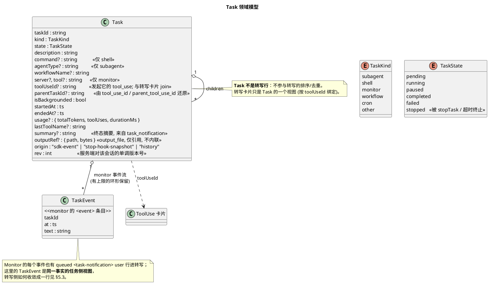
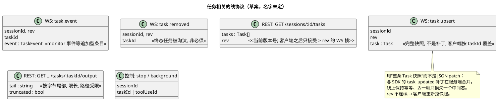
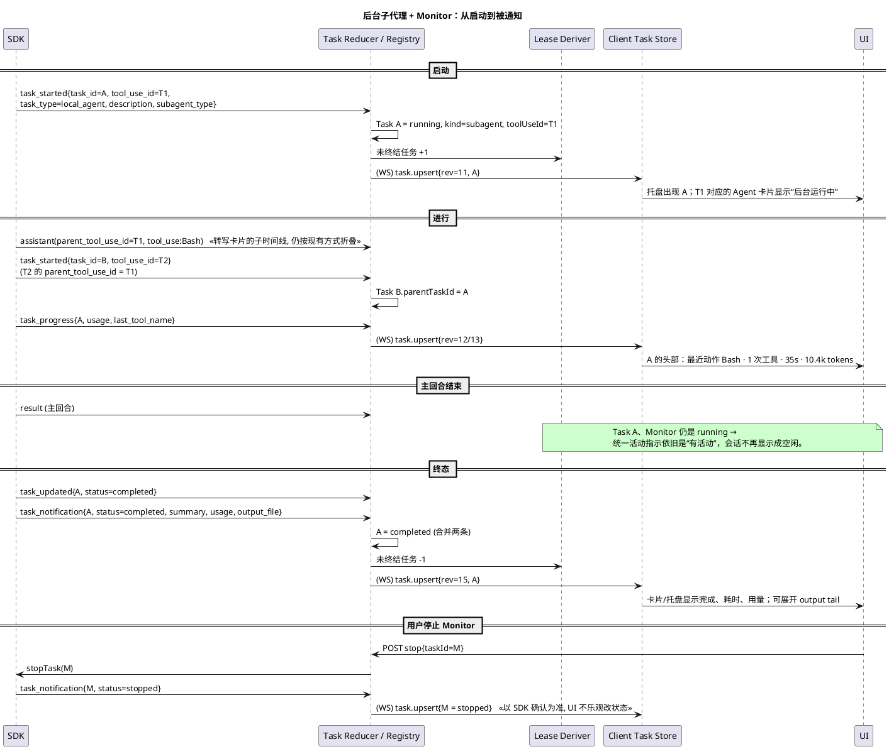
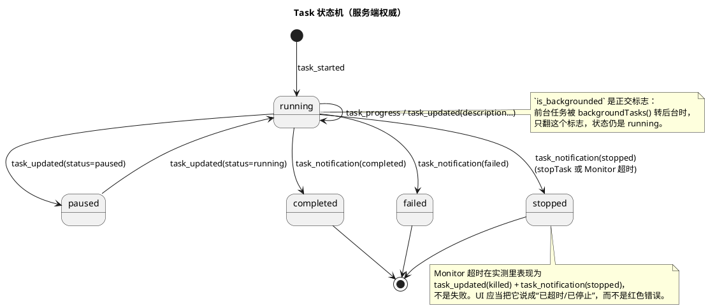
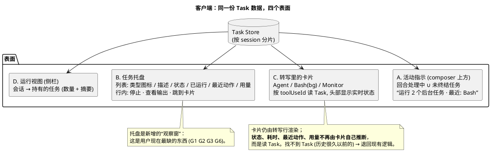
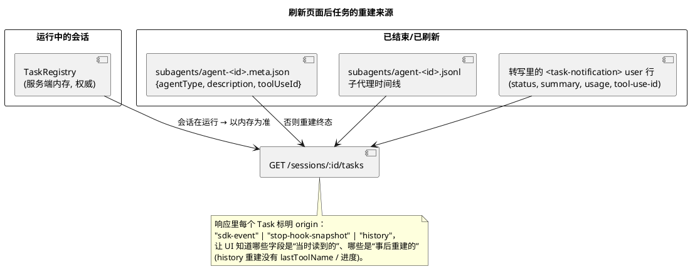

# Claude 后台工作的可观测性：把 subagent / 后台 Bash / Monitor / Workflow 做成一等实体

- 状态：analysis + design（只做调查与架构讨论，未改业务代码、未立 task）
- 日期：2026-10-01
- 范围：仅 Claude Code（resident 与 per-run 两条路径）；其它 provider 不在范围内
- 关联：`docs/proposals/claude-resident-sessions.md`（§15.3 状态栏、§15.6 分隔线）、`docs/proposals/chat-transcript-streaming-architecture.md`（文本流式渲染）、`server/modules/providers/list/claude/claude-host-driver.provider.ts`、`src/modules/chat/transcript/ResidentStatusBar.tsx`、`src/modules/chat/tools/SubagentPanel.tsx`

> **后续（2026-10-01）：** 本文的 Task 模型已被纳入更大的统一设计 `docs/proposals/claude-session-activity-dock.md`（加入真实性/心跳、计划任务、入站消息、控制通道与单一活动坞）。per-run 是否推送 `task_*` 已在其中实测（形态一致）。

> 图用 PlantUML 写成。本机没有渲染器，**图未渲染校验**，提交前请在能渲染的环境里过一遍。
> 标注“实测”的来自本次对真实 SDK 的运行（`@anthropic-ai/claude-agent-sdk` 0.3.165，CLI 2.1.165）；标注“读代码”的来自只读调查，未运行。

---

## 0. 结论摘要

1. **SDK 已经把后台工作的完整生命周期推给了我们**：`task_started`（带 `description`、`subagent_type`、`task_type`、`tool_use_id`）、`task_updated`（状态补丁）、`task_progress`（`usage`、`last_tool_name`）、`task_notification`（终态、`summary`、`usage`、`output_file`），以及可主动调用的 `stopTask(taskId)` 与 `backgroundTasks(toolUseId?)`（Ctrl+B 等价）。
2. **服务端把这些几乎全丢了**：Claude 的 normalizer 对 `system` 事件基本“归一成空”；resident 宿主只读 `task_id` 去增删“租约”（lease），用于决定进程能不能关。没有任何 `task_*` 或 `tool_progress` 帧到达客户端。
3. **客户端因此只能看到“租约计数”**：一个每秒轮询 `GET /api/session-hosts` 的状态栏，按 kind 数个数；没有任务实体、没有列表、没有进度、没有停止按钮。后台子代理的卡片默认折叠，头部只有“running”。
4. **根本问题不在 UI，而在模型**：现在“后台工作”被表示成两个互不相连的东西——(a) 一个只有 id 的租约（为进程生命周期服务），(b) 转写里的 tool 卡片/通知行（为阅读服务）。两者之间没有 join（`task_started` 同时带 `task_id` 与 `tool_use_id`，可以 join，但没人 join）。
5. **建议的方向**：引入服务端权威的 **Task 实体**（事件溯源自 SDK 的 `task_*`，用 Stop hook 的 `background_tasks` 快照校准），经由和转写同源的 WS 推送 + REST 快照交给客户端；客户端建独立的 Task store，转写里的卡片按 `tool_use_id` 绑定它，另有任务托盘、统一的活动指示、跨会话的运行视图和显式的停止/转后台操作。租约退化为 Task 的一个派生视图，不再是独立的数据源。

---

## 1. 实测事实

### 1.1 一次真实运行的事件时间线（实测）

提示：让主代理同时启动 (1) 后台子代理（`Agent`，`run_in_background:true`，内部 `Bash sleep 12`），(2) 后台 `Bash`（循环 3 次、每次 sleep 4），(3) `Monitor` 监视第 2 项。全程约 100 秒，`cwd` 是 `/tmp` 下的独立目录。

| 时刻(s) | SDK 消息 | 关键字段 |
|---|---|---|
| 12.1 | `system/task_started` | `task_id=a69e…`、`tool_use_id=toolu_01Vd…`、`task_type=local_agent`、`description`、`subagent_type=general-purpose` |
| 12.1 | `user`（tool_result） | “Async agent launched successfully. agentId: a69e…” |
| 12.8 | `system/task_started` | `task_id=b0i4…`、`task_type=local_bash`、`description` |
| 13 | `assistant` `tool_use:ToolSearch` | 把 **Monitor 当作延迟加载的工具**载入 |
| 25.4 | `system/task_updated` | `task_id=b0i4…`，`patch:{status:"completed", end_time}`（后台 Bash 结束，**没有**对应的 `task_notification` 系统消息） |
| 26.6 | `system/task_started` | Monitor 自己也是一个任务：`task_id=bjzt…`，`task_type=local_bash` |
| 47.8 | `assistant` 带 `parent_tool_use_id` | 子代理自己的 `tool_use:Bash` |
| 47.9 | `system/task_progress` | `description="Running sleep 12"`、`usage{total_tokens,tool_uses,duration_ms}`、`last_tool_name="Bash"`；**整个运行里只出现 1 次** |
| 50.8 | `system/task_started` | 子代理内部的 Bash 也是一个任务（`task_id=bm82…`，`tool_use_id` 指向子代理内部那次 tool_use） |
| 59.8 | `system/task_notification` | 该内部任务 `status=completed` |
| 62.5 | `system/task_updated` + `task_notification` | 子代理任务 `completed`，带 `usage`、`output_file` |
| 71.6 | `result` | **本回合结束时 Monitor 任务仍在运行** |
| 86.7 | `task_updated`（`killed`）+ `task_notification`（`stopped`） | Monitor 超时（60 s）被杀 |

统计：全程 `system/thinking_tokens` 215 条（服务端已忽略）、`system/init` 4 次（每次新回合开始，含 3 个“没人输入的回合”）、`task_started` 4、`task_updated` 3、`task_notification` 3、`task_progress` 1、**`tool_progress` 0**。

### 1.2 其它实测读数

- **任务会嵌套**：子代理内部的工具调用会再产生任务，其 `tool_use_id` 指向子代理内部的 tool_use；而该 tool_use 的 `parent_tool_use_id` 是外层的 Agent 调用。即 `tool_use_id` / `parent_tool_use_id` 能还原出任务树。
- **后台子代理不发流式碎片**：开着 `includePartialMessages:true` 再跑一次后台子代理，主线有 88 条 `content_block_delta`、`parent_tool_use_id` 全为空；**子代理自己的消息只以整条 `assistant`（带 `parent_tool_use_id`）到达，没有任何带 `parent_tool_use_id` 的 `stream_event`**。这使得此前担心的“子代理的增量污染主会话 live 行”在 Claude 上不会发生，并顺便消除了 `blockKey` 以 `parentToolUseId` 分域的实际必要性（分域仍无害）。
- **Monitor 的事件走“排队的通知”，不走系统消息**：JSONL 里有 `queue-operation enqueue/dequeue`，随后是一条 `user` 行，`origin:{kind:"task-notification"}`，内容是 `<task-notification><task-id>…</task-id><summary>Monitor event: …</summary><event>tick1…</event></task-notification>`。超时那条的 `<event>` 是 `[Monitor timed out — re-arm if needed.]`。
- **子代理历史落在旁路文件**：`<project>/<sessionId>/subagents/agent-<id>.jsonl`，并有 `agent-<id>.meta.json`：`{agentType, description, toolUseId}`。
- **SDK 的控制面**（读 `sdk.d.ts`）：`stopTask(taskId)`（会产出 `status:'stopped'` 的 `task_notification`）、`backgroundTasks(toolUseId?)`（把前台任务转后台）；Stop hook 输入里的 `background_tasks: BackgroundTaskSummary[]` 带完整字段——`id`、`type`（`shell`/`subagent`/`monitor`/`workflow`）、`status`、`description`、`command?`、`agent_type?`、`server?`、`tool?`、`name?`。

### 1.3 现状的数据流（读代码）

```plantuml
@startuml
title 现状：SDK 推来的后台工作信息，在哪里被丢掉

skinparam componentStyle rectangle

package "Claude CLI / SDK" as SDK {
  [system/task_started\n(task_id, tool_use_id, description,\n subagent_type, task_type)] as TS
  [system/task_progress\n(usage, last_tool_name)] as TP
  [system/task_updated\n(patch.status)] as TU
  [system/task_notification\n(status, summary, usage, output_file)] as TN
  [tool_progress\n(elapsed_time_seconds)] as TPR
  [Stop hook\nbackground_tasks[]: 完整描述] as SH
  [queued <task-notification> user rows\n(含 Monitor 的 <event>)] as QN
}

package "服务端" as SRV {
  [normalizeMessageRows\nsystem 事件基本归一成空] as NORM
  [Resident host driver\nobserveHeldWorkEvent / reconcileHeldWork] as HD
  [Per-run host driver\nbackgroundWorkLease: 看 tool_use] as PRD
  [SessionHostManager\nbinding.leases = {kind, id}] as MGR
  [GET /api/session-hosts] as REST
}

package "客户端" as CLI {
  [useSessionHosts\n轮询 1s, 标签页隐藏时停] as POLL
  [ResidentStatusBar\n按 kind 数个数] as BAR
  [SubagentPanel\n默认折叠, 头部只有 running] as SP
  [任务通知行\n仅在 user 文本里有 <task-notification> 时出现] as NR
}

TS --> HD : 只读 task_id → 加租约
TN --> HD : 只读 task_id → 删租约
SH --> HD : 只留 id
TS ..> NORM : 丢弃
TP ..> NORM : 丢弃 (unhandledSystemSubtypes)
TU ..> NORM : 丢弃
TPR ..> NORM : 丢弃
QN --> NORM : 作为 user 文本进转写
HD --> MGR : leaseAdded/Removed
PRD --> MGR : lease(id = tool_use 块 id)
MGR --> REST
REST --> POLL
POLL --> BAR
NORM --> SP : 仅子代理自己的 assistant/tool 行\n(parent_tool_use_id) 折进卡片
NORM --> NR

note bottom of MGR
  租约为“进程能不能关”服务：
  只有 kind + id，没有描述/类型/进度。
  resident 路径从不产出 monitor 租约；
  两条路径的租约 id 命名空间不同
  (任务 id vs tool_use 块 id)，彼此不能 join。
end note
@enduml
```

---

## 2. 用户视角的缺口（每条对应一个代码原因）

| # | 用户看不到/做不到 | 代码原因 |
|---|---|---|
| G1 | 不知道**有哪些**后台任务（哪个子代理、哪个 Monitor、哪个 cron），只有一个数字 | 弹层只渲染“每个 lease kind 的计数”；lease 只有 `{kind,id}`；`description` 等字段在服务端被丢（`ResidentStatusBar.tsx`、`claude-host-driver.provider.ts` 的 `tasksFromStopList` 只留 `id`） |
| G2 | 没有“任务”这个东西：无状态、最近一次工具、token、已运行时间 | `task_progress` / `task_updated` 从不转发；客户端没有 Task store / hook / 面板 |
| G3 | 后台子代理跑着时，卡片头部只显示“running”，要点开才看到最近动作；也没有耗时 | `SubagentPanel` 只读 `subagent.status` 与折叠的时间线；`tool_progress`、`task_progress` 都不在任何地方展示 |
| G4 | 主回合结束后，会话看起来**空闲**，实际还有任务在跑 | 活动指示由“回合处理中”驱动，`complete` 即消失；租约计数是另一个轮询信号，两者从不合并 |
| G5 | 租约变化最多 1 秒才出现，隐藏标签页时不更新；短命任务可能整个错过 | 没有主机状态的推送事件，只有 `GET /api/session-hosts` 轮询 |
| G6 | **无法停止**单个任务，或把前台长命令转后台 | SDK 的 `stopTask` / `backgroundTasks` 没有被接线；UI 唯一的终止手段是关整个进程 |
| G7 | 后台 Bash 和 Monitor 没有专门展示，看不到它们的输出 | Bash 卡片无视 `run_in_background`；没有 Monitor 的渲染配置；成功结果默认隐藏；`output_file` 没人读 |
| G8 | 完成通知只是一行带状态点的摘要，没有耗时/用量，也不能跳回发起它的卡片 | 通知行只解析 `summary`/`status`；`<usage>`、`<tool-use-id>` 被解析后不展示 |
| G9 | “没人输入的回合”的来源（定时任务 / 后台完成 / 监视事件 / 其它会话）显示成“未知” | 实时帧不带 `origin`；触发来源只发给了通知，没盖到帧上（读代码，**未在真实运行里核对分隔线的实际文案**） |
| G10 | 跨会话的“运行中”视图只能看到哪些会话在跑，看不到谁持有什么任务 | `RunningView` 只列会话；快照里没有任务明细 |
| G11 | 同一个任务在“租约”和“转写卡片”里是两个互不相连的东西 | resident 的租约 id 是任务 id，per-run 的租约 id 是 `tool_use` 块 id；`task_started` 同时带两者，但没人 join |
| G12 | 刷新页面后，若会话已经没有对应的活动卡片，则这些后台任务的详情完全找不回 | 任务信息不进转写、不进 REST；历史里只有子代理旁路文件与 `<task-notification>` 用户行 |

---

## 3. 目标架构

### 3.1 设计原则

| # | 原则 | 取代的现状 |
|---|---|---|
| P1 | **后台工作是一等实体 `Task`**，不是转写行，也不是租约计数 | 租约只有 `{kind,id}`；卡片靠转写行拼 |
| P2 | **服务端权威、事件溯源**：由 `task_started/updated/progress/notification` 增量构建，用 Stop hook 的 `background_tasks` 快照校准（防漏事件） | 只读 `task_id` 做租约增删 |
| P3 | **推送与快照同源**：WS 实时帧 + REST 快照来自同一个 `TaskRegistry`，晚加入的客户端先拉快照再接增量 | 1 秒轮询，隐藏标签页即停 |
| P4 | **转写与任务按 `tool_use_id` 关联，不重复存放**：卡片是 Task 的一个视图 | 卡片自己根据折叠行猜状态 |
| P5 | **任务的输出是任务的子流，不进主转写**：Monitor 事件、`output_file` 的尾部都挂在 Task 上 | Monitor 事件以 user 文本形式混进转写 |
| P6 | **控制面显式**：停止、转后台走专门的控制请求，并由 `task_notification(stopped)` 确认，而不是由 UI 乐观改状态 | 只能关整个进程 |
| P7 | **租约是派生量**：进程能不能关，由“是否存在未终结的 Task / cron”推出 | 租约是独立的数据源，和任务各记各的 |
| P8 | **live 与 history 同一个 `TaskView`**：刷新后能从落盘材料（子代理旁路文件、`task-notification` 行）重建终态 | live 与 history 的字段、形态不同 |

### 3.2 分层

```plantuml
@startuml
title 目标架构：Task 作为一等实体（箭头 = 数据流向）

skinparam componentStyle rectangle

package "Claude CLI / SDK" as SDK {
  [system/task_* 事件] as EV
  [tool_progress] as TPR
  [Stop hook: background_tasks[], session_crons[]] as SH
  [control: stopTask / backgroundTasks] as CTL
}

package "服务端 (per session)" as SRV {
  [Task Reducer\n(纯函数: 事件 → Task 状态)] as RED
  [TaskRegistry\nMap<taskId, Task> + 任务树 + 版本号 rev] as REG
  [Lease Deriver\n未终结 Task / cron → 租约\n(进程能否关的依据)] as LD
  [Task Output Tail\n按需读 output_file (受限路径, 限长)] as OUT
  [Control Gateway\nstop / background → SDK 控制请求] as CG
}

package "传输" as T {
  [WS: task.upsert / task.removed\n(带 rev)] as WS
  [REST: GET /sessions/:id/tasks\n(快照 + rev)] as REST
  [REST: GET .../tasks/:taskId/output?tail=] as ROUT
  [WS/REST: POST stop / background] as RCTL
}

package "客户端" as C {
  [Task Store\n(按 session 分片, 按 rev 合并)] as TST
  [Selectors\ntasksBySession / taskByToolUseId / liveCount] as SEL
  [Task Tray\n任务托盘 (列表+详情)] as TRAY
  [Tool Card Binding\nAgent/Bash/Monitor 卡片读 Task] as CARD
  [Unified Activity Indicator\n回合处理中 ∪ 未终结任务] as ACT
  [Running View\n跨会话: 谁持有什么] as RV
}

EV --> RED
TPR --> RED
SH --> RED : 校准 / 补漏
RED --> REG
REG --> LD
REG --> WS
REG --> REST
REG --> OUT
OUT --> ROUT
RCTL --> CG
CG --> CTL
CTL ..> EV : task_notification(stopped)

WS --> TST
REST --> TST
ROUT --> TRAY
TST --> SEL
SEL --> TRAY
SEL --> CARD
SEL --> ACT
SEL --> RV
TRAY --> RCTL : 停止 / 转后台

note bottom of RED
  与文本流式设计同一个纪律：
  事件带稳定 key (task_id)，归约幂等，
  缺口 (rev 不连续) 触发重新拉快照。
end note
@enduml
```

### 3.3 领域模型



### 3.4 线协议（草案）



### 3.5 一个后台子代理的生命周期



### 3.6 Task 状态机



### 3.7 客户端表面与数据绑定



### 3.8 live 与 history：同一个 TaskView



---

## 4. 与“助手文本流式渲染”设计的关系

- **不冲突，是同一纪律的第二次应用**：文本流式的核心是“一块一实体、稳定 key、幂等归约”；这里是“一任务一实体、稳定 `taskId`、幂等归约（整条快照覆盖 + `rev`）”。
- **子代理文本不会流式到客户端**（§1.2 实测），所以子代理的内容只通过“整条 assistant 行，带 `parent_tool_use_id`，折叠进卡片”到达；它与 `blockKey` 方案无交集。`blockKey` 已按 `(会话, parentToolUseId)` 分域，对此无害。
- **转写与任务的唯一连接点是 `toolUseId`**：卡片用它找 Task；Task 不进入转写的排序与去重。

---

## 5. 需要先裁定的设计问题

### 5.1 数据源的权威顺序

- SDK 的 `task_*` 事件是增量，**可能漏**（实测里后台 Bash 结束只有 `task_updated`，没有 `task_notification`；`task_progress` 一次运行才 1 条）。Stop hook 的 `background_tasks` 快照是权威但**只在回合边界触发**。
- 建议：事件做增量，Stop hook 做校准（快照里没有的未终结任务 → 标记为“已结束（原因未知）”；快照里有而事件里没见过的 → 补建，`origin:"stop-hook-snapshot"`）。需要裁定“已结束（原因未知）”如何展示。

### 5.2 resident 与 per-run 两条路径对齐

- resident 宿主已经在读 `task_*`；per-run 路径只看 `tool_use` 推断租约，**不读 `task_*`**。要让任务视图对两条路径一致，per-run 路径也要读 `task_*`。需要确认 per-run 的 CLI 在“持有 stdin 等后台工作”期间是否同样推送 `task_*`（resident 里已观察到；per-run 本次**未实测**）。

### 5.3 Monitor 事件在转写里怎么办

- 现状：每个 Monitor 事件都是一条排队的 `<task-notification>` 用户行，既进转写又会触发一个“没人输入的回合”。
- 选项：(a) 保持现状，只在任务侧**额外**累积 `TaskEvent`；(b) 转写里把同一任务的连续事件收敛成一行“Monitor · N 个事件”，点开看列表；(c) 完全不进转写，只在任务侧。
- 倾向 (b)：转写仍是对话的权威记录（不篡改 CLI 的行为），但视觉上折叠。需要裁定。

### 5.4 租约与任务的关系

- 租约决定“进程能不能关/能不能进入静默关闭”，已有测试与行为（`claude-resident-idle`、静默上限 24h 等）。把它改成 Task 的派生量要小心：**行为不能变**。建议先“并存、由 Task 推出租约并与现有租约对照”，一致后再收敛；`resident` 从不产出 `monitor` 租约的差异需要一并处理。

### 5.5 输出读取与安全

- `output_file` 在 `/tmp/claude-<uid>/…` 下，大小不定。读取必须：路径白名单（只允许该会话的 tasks 输出目录）、按尾部取、字节上限、对二进制/超长行截断。需要裁定上限与是否支持跟随（follow）。

### 5.6 控制面语义

- `stopTask` 会产出 `stopped` 的 `task_notification`；`backgroundTasks(toolUseId?)` 不带参数会把**所有**前台任务转后台。UI 上的“转后台”建议只做带 `toolUseId` 的单任务版本，避免误伤。需要确认 resident 的控制通道能否调用这两个方法（宿主驱动里有一段注释列出 `stopTask` 等方法，**未核对是否已接线**）。

### 5.6b “没人输入的回合”的来源

- JSONL 里这些用户行带 `origin:{kind:"task-notification"}`，而客户端分隔线读的是 `origin.trigger` / `origin.sender`；读代码的结论是 Claude 路径不给实时帧盖 `origin`。**我没有在真实运行里核对分隔线的实际文案**，这一条只能作为待核实项。

### 5.7 多客户端与刷新

- 多个标签页同时看同一会话：Task 的 `rev` 是**会话级**单调版本，各客户端各自持有游标；晚加入者拉快照。这与暂缓的文本协议层（`seq`/快照）有概念重叠，需要决定“任务协议”是否独立于它先行（建议独立：任务数据量小，整条快照覆盖，天然幂等）。

---

## 6. 分阶段路线（建议，尚未立 task）

1. **事实补查**（小）：per-run 路径是否同样推送 `task_*`；`stopTask` / `backgroundTasks` 在 resident 控制通道上是否可用；Stop hook 的 `background_tasks` 在真实 resident 会话里的实际形态；分隔线在真实“没人输入的回合”里的显示。
2. **服务端 Task Reducer + Registry + REST 快照**（只读、不影响现有租约）：把 `task_*`、`tool_progress` 归约成 Task；与现有租约并存、对照。
3. **WS 推送 + 客户端 Task Store**：先只落 store 与一个调试可见的最小列表。
4. **表面**：任务托盘 → 卡片绑定 → 统一活动指示 → 运行视图。
5. **控制面**：stop / 单任务转后台。
6. **输出尾部**：`output_file` 与 Monitor 事件的展示与收敛。
7. **收敛租约**：由 Task 派生，保持现有行为不变。

## 7. 本次未验证的内容

- 全部“读代码”结论未运行验证；尤其是 G9（分隔线文案）、`origin` 是否确实未盖到实时帧、`stopTask` 是否已接线。
- 只做了**一次**长运行（后台子代理 + 后台 Bash + Monitor）与一次短运行（后台子代理 + 流式）。`Workflow` 任务、`cron`/`ScheduleWakeup`、`paused` 状态、`task_progress` 的节奏（只见 1 条）都没有实测。
- 没有在 per-run 路径上实测过 `task_*` 的推送。
- 本文的线协议与字段名仅是草案，用于讨论形态，未做任何兼容性或体积评估。
