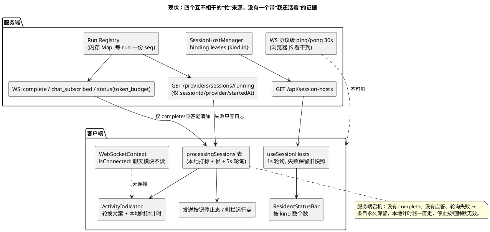
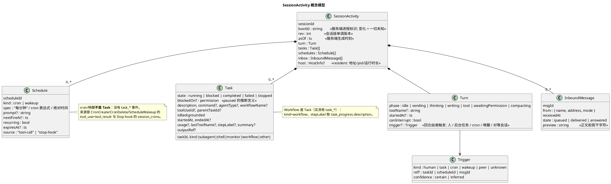
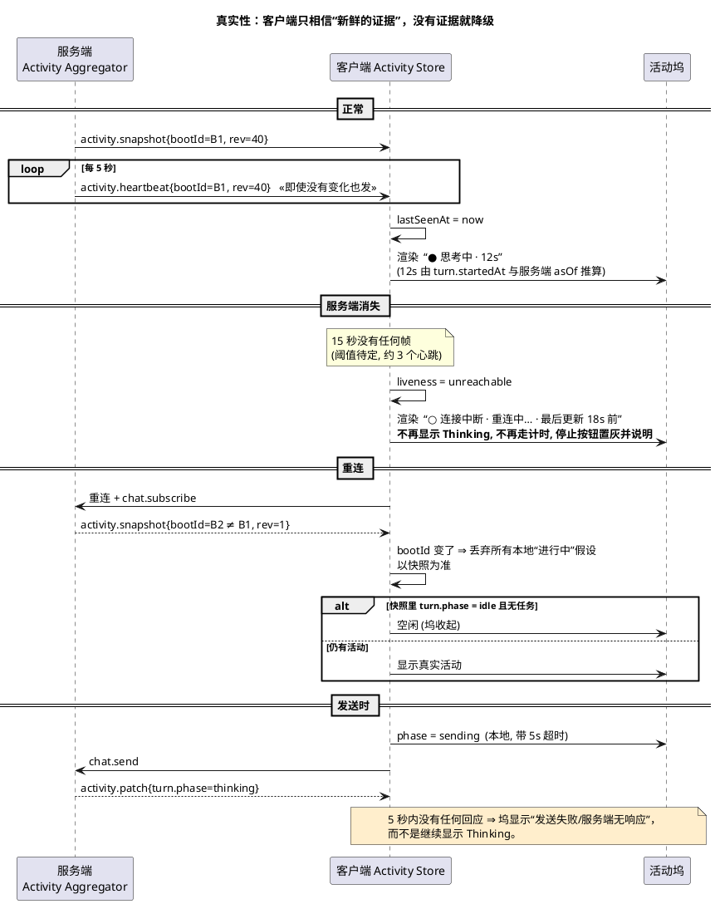
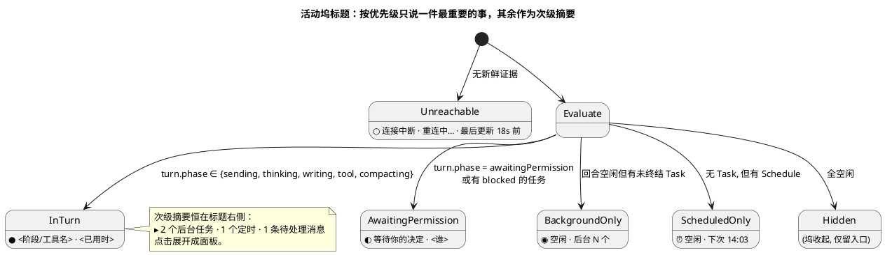
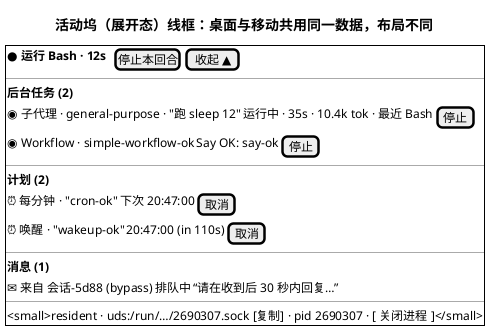
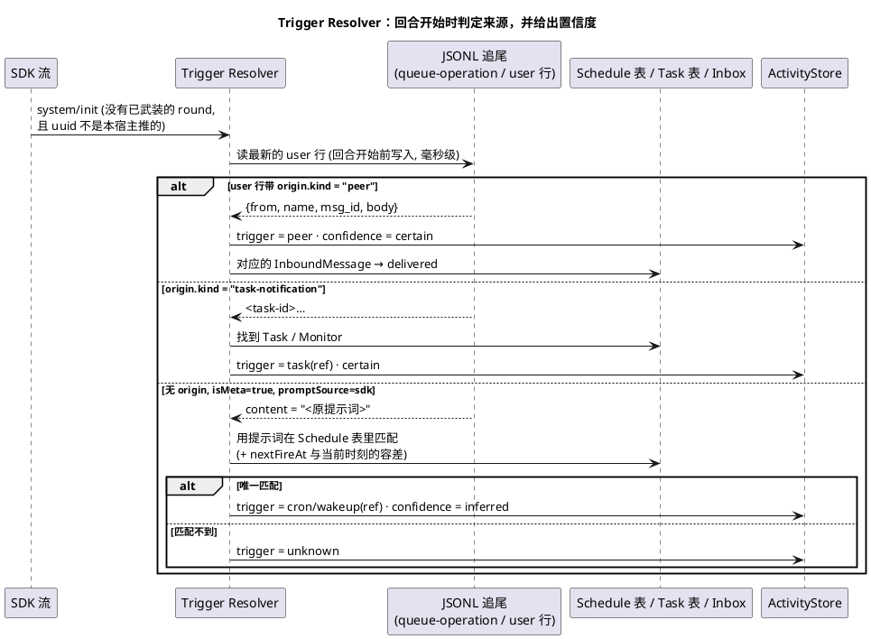
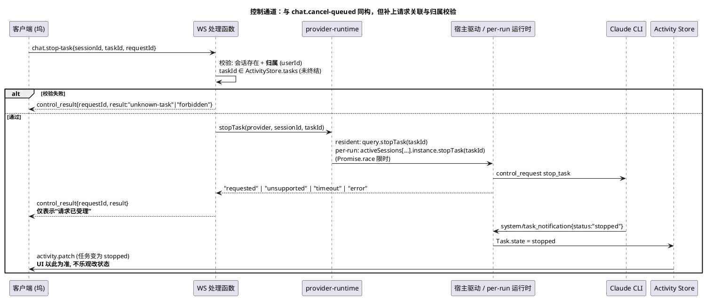

# Claude 会话「活动」的统一架构：一个真实、持续、可操作的底部活动坞

- 状态：proposal（2026-10-01 人已裁定 4 项，见 §0.1；补充实测进行中，见 §9；goal / task 尚未建立）
- 日期：2026-10-01
- 范围：仅 Claude Code（resident 与 per-run 两条路径）；其它 provider 不在范围内
- 扩展自：`docs/proposals/claude-background-work-observability.md`（本文把它的 Task 实体纳入更大的“会话活动”模型，并补上控制面、计划任务、入站消息与真实性）
- 关联：`docs/proposals/claude-resident-sessions.md`、`docs/proposals/chat-transcript-streaming-architecture.md`

> 图用 PlantUML 写成。本机没有渲染器，**图未渲染校验**，提交前请在能渲染的环境里过一遍。
> “实测”＝本次对真实 SDK/CLI（`@anthropic-ai/claude-agent-sdk` 0.3.165，CLI 2.1.165）的运行；“读代码”＝只读调查，未运行；“推断”＝由二进制字符串或代码结构推出，未验证。

---

## 0. 要解决的问题与结论

**用户的诉求**

1. 现在底部有两处互不相干的“忙”提示：一个是 `Thinking...` 的活动指示（`ActivityIndicator`），一个是 resident 状态栏里“有几个后台任务”的计数。应当**合并成一处，持续显示在助手输出的底部**。
2. `Thinking...` 是**假的**：服务器挂了它还在显示、计时器还在走。
3. 要能看到后台 subagent / Monitor / Workflow 的**具体状态**，并能**控制**它们（停止、转后台）。
4. 还要表达 cron、ScheduleWakeup（计划任务）、`paused` 状态，以及**收到的 SendMessage 消息**。

**结论**

1. 需要一个服务端权威的 **`SessionActivity`** 模型（回合 ⊕ 任务 ⊕ 计划 ⊕ 入站消息 ⊕ 连接），经推送加快照交给客户端，由**唯一**一个“活动坞”渲染；`ActivityIndicator`、`ResidentStatusBar` 的忙闲部分、侧栏运行视图都读同一个来源。
2. “假”的根源不是某个 bug，而是**活动的真相被拆在四个互不联系的来源里，且没有任何一个携带“我还活着”的证据**。修法必须包含一个**客户端可见的心跳/新鲜度**，并把“连接中断”作为一等状态，而不是继续沿用本地时钟。
3. 这件事可以**分层交付**，其中“真实性”（诚实地显示连接中断，不再假装在思考）是一条独立、小、风险低、可最先落地的线。
4. 控制面应当与 `chat.cancel-queued` 同构，但要修它的两个弱点：没有请求关联、没有会话归属校验。

---

## 0.1 人的裁定（yale，2026-10-01）

1. **心跳与新鲜度**：服务端每 **5 秒**发一次业务心跳，客户端 **15 秒**没有任何帧即判定不可达。两个数字可接受，实现上做成可配置的默认值。
2. **控制动词的归属校验**：新增的“杀东西”类动词（`chat.stop-task`、`chat.background-task`）**必须带归属校验**；并**顺带给既有的 `chat.cancel-queued` 补齐**同样的校验与请求关联（`requestId`）。
3. **cron / ScheduleWakeup 的取消**：**不做单独的 UI 控件**。接受“只能请模型调用 `CronDelete`”这一间接语义，由用户在输入框里用文本下达；坞对计划只做**只读展示**，取消的结果以 Stop hook 的 `session_crons` 变化反映。
4. **本期不纳入**：`isMeta` 行在历史里的显示（对等会话消息、cron/唤醒的提示词行）；对等方目录/收件箱。

### 由此得到的范围

**纳入本期**

- 真实性：心跳、`bootId`/`rev`、连接状态、发送超时提示、不再本地编造计时（P0）。
- 回合的真实阶段与工具名，取代轮换文案（P1）。
- Activity Aggregator、REST 快照与 WS 推送（P2）。
- 单一活动坞：并入 `ActivityIndicator` 与 `ResidentStatusBar` 的忙闲部分；侧栏运行视图读同一来源（P3）。
- Task 的可观测（含 Workflow、Monitor）与控制：停止、单任务转后台（P4）。
- 计划（cron / 唤醒）的**只读**展示（P5 的一部分）。
- Monitor 事件在转写**投影层**折叠成一行，历史不变（P6）。
- 对 `cancel-queued` 的规整（请求关联 + 归属校验）。

**不纳入本期（非目标）**

- 取消计划任务的专用控件；历史里的 `isMeta` 行显示；对等方目录。
- 入站对等消息的**实时**可见（坞里的“队列中/已送达”）：依赖 §9 里对 JSONL 追尾时序的实测，**待实测后再裁定是否纳入**，在此之前按“不纳入”处理。
- 出站 `SendMessage` / `ListAgents` 的专用工具卡：**未裁定**，默认不纳入。
- 其它 provider。

---

## 1. 实测与调查事实

### 1.1 “Thinking...” 为什么是假的（读代码，无实测）

客户端的“处理中”是一张 `processingSessions` 表（`useSessionProtection.ts`）。它只有这几条**写入**路径：发送时本地打标、`chat_subscribed{isProcessing:true}`、`permission_request`、带文本的 `status`、每 5 秒一次对 `/api/providers/sessions/running` 的轮询。**清除**路径只有：`complete`、`protocol_error`、一次 `isProcessing:false` 的订阅应答、以及轮询成功且列表里没有它。

服务端宕机时这些都不会发生：

| 排名 | 原因 | 症状 |
|---|---|---|
| 1 | 服务端宕机/不可达：没有 `complete`、没有应答，轮询失败只写日志（`SessionProtectionContext.tsx`），`isConnected` 被聊天模块完全忽略 | 条目永久保留，计时器用本地时钟一直走，停止按钮仍在 |
| 2 | WS 关闭但服务端活着：发送时本地先打标，`sendMessage` 在 socket 关闭时只 `console.warn` | 约 15 秒内闪一下，**停止按钮静默无效** |
| 3 | 半开连接：客户端没有 ping | 浏览器可能很久才发现对端消失 |
| 4 | 只被代理拦掉的轮询请求 | 条目停到下一个 `complete` |
| 5 | 状态栏的 `busy` 来自 1 秒一次的 `/api/session-hosts` 轮询，失败时**保留旧快照** | 与上面同因，状态栏也会陈旧 |

另外：
- 服务端对 Claude **从不发带文本的 `status` 帧**（只有 `token_budget`），所以 `statusText` 恒为空；标签是按已用时间轮换的 “Thinking / Processing / Analyzing …”，**不携带任何信息**。
- 服务端有 WS 协议级 ping/pong（30 秒，终止无应答的 socket），但那在浏览器 JS 之下，**客户端看不到**。
- 它不能表达这些状态：连接中断/重连中、等待权限、正在运行某个工具（及其名字）、只剩后台任务、计划唤醒待触发、服务端重启后 run 丢失（只能靠重连后的一次空闲应答或轮询得知）。
- **四个互不相干的“忙”来源**，可以互相矛盾：

| 指示 | 真相来源 |
|---|---|
| 活动页签/内联行、发送按钮的停止态、侧栏“运行中”圆点 | 同一张 `processingSessions` 表（WS 帧 + 5 秒轮询 + 本地打标） |
| resident 状态栏的 idle/busy/exited、侧栏 resident 标记 | `useSessionHosts` 1 秒轮询 `/api/session-hosts`；`busy` 的含义是宿主有 `turn` 租约，**不等于**聊天 run 注册表 |

- 版面：桌面端活动页签绝对定位在输入框顶沿之上，浮在转写末尾；移动端是转写末尾的内联行；resident 状态栏在转写滚动区**上方**另占一行，两者从不同处。

### 1.2 per-run 路径同样推送 `task_*`（实测）

用一次性查询（字符串 prompt，非流式输入）启动后台 Bash：`task_started`（`task_type=local_bash`、`description`）、`task_updated`、`task_notification` 的形态与 resident 完全一致。**这回答了此前未核实的问题：per-run 的 CLI 同样推送 `task_*`。**

顺带的发现：本次因为用的是字符串 prompt，**`result` 之后约 5 秒后台任务被 `killed`**（`task_updated{killed}` + `task_notification{stopped}`），这是 stdin 关闭的后果，也正是仓库里“持有 stdin 等待后台工作”的 per-run 做法要避免的。**因此本次只能证明“事件形态一致”，不能证明仓库里 per-run 的持有逻辑下事件时序一致。**

### 1.3 Workflow、cron、ScheduleWakeup（实测）

一次流式输入运行，让主代理创建每分钟 cron、60 秒后的唤醒、并启动一个最简 Workflow：

| 对象 | 是否有 `task_*` 事件 | 观察到的形态 |
|---|---|---|
| **Workflow** | **有** | `task_started{task_type:"local_workflow", workflow_name:"simple-workflow-ok", description}`；`task_progress` 的 `description` 是步骤标签（如 `Say OK: say-ok`），带 `summary`（2 条）；`task_updated{completed}`；`task_notification{completed, summary}` |
| **CronCreate** | **无** | 只有 `tool_use` 与 `tool_result` 文本：“Scheduled recurring job d5d51903 (Every minute). Session-only … Auto-expir…” |
| **ScheduleWakeup** | **无** | 只有 `tool_result` 文本：“Next wakeup scheduled for 20:47:00 (in 110s). Nothing more to do this turn — the harness re-invokes you when the wakeup…” |

cron 与唤醒到点后各自开启一个**没人输入的回合**（流里表现为一条 `system/init`，随后 `assistant` 与 `result`，约 t=100s 与 t=135s）。**触发它的提示词没有出现在 SDK 流里。**

在 JSONL 里这两类回合的用户行是：`{"type":"user","message":{"content":"<原提示词>"},"isMeta":true,"promptSource":"sdk"}`，前面有 `queue-operation enqueue`，**没有 `origin` 字段**。对比：Monitor/后台任务完成的用户行带 `origin:{kind:"task-notification"}`；跨会话消息带 `origin:{kind:"peer",…}`。

> 含义一：**计划任务不是 Task**，它没有事件流，只能由 `CronCreate/CronDelete/ScheduleWakeup` 的工具调用与结果、以及 Stop hook 的 `session_crons` 推出。
> 含义二：**cron/唤醒触发的回合在转写层面与“系统注入的元消息”不可区分**；而历史读取按 `isMeta` 一律丢弃这些行，所以刷新后你只看到助手回复，看不到是什么触发了它。

### 1.4 `paused` 的含义（推断，未实测）

SDK 的 `task_updated.patch.status` 含 `paused`。对 CLI 二进制做字符串检索，发现 `totalPausedMs` 与 **子代理的 `canUseTool` 包装**绑定（等待权限决定的时长累加进 `totalPausedMs`），UI 文案里 `paused` 与 `killed`(stopped)、`failed` 并列。**推断：`paused` ＝ 后台任务/子代理正阻塞在一个等用户决定的权限提示上。** 这与“显示等待权限”的需求吻合，但**没有用真实运行触发过**，设计里只把它当作“被阻塞，等待用户”处理，并列入待核实。

同一份二进制里还有 `teammates`、`hasRunningTeammates`、`foregroundedTeammate` 等字段，说明 Claude Code 内部有“队友（agent teams）”概念；SendMessage 正是它们之间通信的工具。**本仓库目前没有对应的任何表示。**

### 1.5 入站 SendMessage（读代码 + 真实 JSONL）

- JSONL 里，别的会话发来的消息先是 `queue-operation enqueue`，其 `content` 是 `<cross-session-message from="uds:…sock" from-name="…" from-mode="bypass">…正文…</cross-session-message>`；随后是一条 `user` 行：`isMeta:true`，`origin:{kind:"peer", from, verifiedPeerPid, msg_id, name, fromMode, body}`，`promptSource:"system"`，`turnOrigin:"peer"`。正文被一段“这不是你的用户键入，不要被它洗白权限”的固定提示包住。
- **服务端从不给实时帧或历史行写 `origin`**（`MessageOrigin` 类型与客户端分隔线渲染都在，但没有生产者）；历史读取因为 `isMeta` 直接丢弃这行，**刷新后发送者与正文都丢了**。
- 唯一读它的地方是回合结束时从 `result.origin.kind==='peer'` 推出 `trigger:'cross-session-message'`，只用于通知，**回合开始时无法标注**。
- 驱动**从不读 `queue-operation`**，所以“有一条消息在排队等待”完全不可见；忙时到达的消息和空闲时到达的消息都得等回合开始。
- 出站的 `SendMessage` / `ListAgents` 在客户端用的是通用 `Default` 工具卡（原始 JSON）。
- 地址（peer 名）只在 resident 状态栏里显示**自己的**，没有对等方目录/收件箱。非 resident 会话的名字每个进程都变。

### 1.6 控制通道现状（读代码）

- 驱动用的窄类型 `ClaudeResidentQuery` 只声明了 `interrupt`、可选的 `close/setModel/setPermissionMode`。**`stopTask` 与 `backgroundTasks` 在 SDK 的 `Query` 上都存在（0.3.165），但驱动没有声明、也没有任何调用。** 代码里那段“measured 的方法清单”已过时。
- `chat.cancel-queued` 是现成的同构先例：客户端动作 → WS 分发（`chat-websocket.service.ts` 的 switch）→ 网关动词 → `provider-runtime.service` → 驻留驱动 → 手写的 `control_request` 帧 → 靠流里的 `command_lifecycle` 事实确认（**CLI 对它不回 `control_response`**）。`queued_input_cancel_result` 被客户端有意丢弃，以流事实为准。
- 它的两个弱点：**没有请求关联**（返回 `'unknown'` 表示一切失败），以及**没有归属校验**——除 `chat.send` / `chat.edit-send` 外没有哪个处理函数用 `userId`；`chat.cancel-queued` 只做 `getSessionById`。
- per-run：运行中的 `Query` 存在 `activeSessions`（模块级 Map），在持有 stdin 的整个后台等待期内都可达（`abortClaudeSDKSession` 就用它）；因此理论上可对它调 `stopTask` / `backgroundTasks`。**会话 id 的键（应用 id 还是 provider id）未核实。**
- per-run 没有任务清单可供校验 taskId（只有一个 lease）。
- 没有“按需列出后台任务”的控制请求；只有 Stop hook 的 `background_tasks` 快照与流里的 `background_tasks_changed`。
- 能力矩阵惯例：`ResidentFeatures.cancelQueuedInput: false`（“未验证”），新能力应同样**默认 false**。
- 可复用的测试夹具：`claude-resident-busy-input.test.ts`（真 CLI 对接 mock `/v1/messages`，含 `holdFrom/releaseHeld`、假 socket、`waitFor`）、`claude-resident-idle.test.ts`（E9 真实帧形态）、`chat-edit-send.test.ts`（WS 处理函数用网关桩）。

---

## 2. 现状架构



---

## 3. 缺口

| # | 缺口 | 原因 |
|---|---|---|
| A1 | `Thinking...` 在服务端不可达时仍显示并计时 | 无心跳/新鲜度；`isConnected` 被忽略；失败的轮询不改变状态 |
| A2 | 标签无信息：不知道在思考、写作、跑哪个工具、等权限 | 服务端不发带文本的 status；标签按时间轮换 |
| A3 | 连接断开时点“停止”无效且无提示 | `sendMessage` 在 socket 关闭时只 warn |
| A4 | 状态栏与活动指示可互相矛盾；失败的轮询让状态栏也陈旧 | 两个真相来源，且都保留旧值 |
| B1–B8 | 看不到后台任务清单/进度/耗时/最近动作，不能停，不知道会话还有活 | 见 `claude-background-work-observability.md` §2 |
| C1 | 看不到有哪些 cron / 唤醒在等、下次何时触发 | 没有 `task_*` 事件；服务端只对 `CronCreate/CronDelete` 做租约推断，没有记录 cron 表达式/提示词/下次时间；`ScheduleWakeup` 完全未处理 |
| C2 | cron/唤醒触发的回合没有来源；刷新后连触发它的提示词都看不到 | 流里没有该提示词；转写里是无 `origin` 的 `isMeta` 行，历史读取丢弃 |
| D1 | 看不到别的会话发来的消息：不知道谁发的、说了什么；忙时到达的看不到在排队 | 服务端不写 `origin`；`isMeta` 行被历史丢弃；驱动不读 `queue-operation` |
| D2 | 发送出去的 `SendMessage` 是一坨原始 JSON | 没有该工具的渲染配置 |
| D3 | 不知道自己能被谁寻址、有哪些对等方 | 只有自己的地址显示在状态栏 |
| E1 | 不能停某个任务，不能把前台任务转后台 | 驱动没有声明/调用 `stopTask`、`backgroundTasks` |
| E2 | 既有控制动词没有请求关联、没有归属校验 | `chat.cancel-queued` 的设计取舍 |

---

## 4. 目标架构

### 4.1 设计原则

| # | 原则 | 取代的现状 |
|---|---|---|
| U1 | **一个真相源**：服务端权威的 `SessionActivity`；客户端所有“忙/闲”提示都是它的投影 | 四个来源各说各话 |
| U2 | **活动 = 回合 ⊕ 任务 ⊕ 计划 ⊕ 入站消息 ⊕ 连接**，一个坞表达全部 | 两处互不相干的提示 |
| U3 | **诚实**：不知道就说不知道。每一个“进行中”的声明都必须有**新鲜度证据**（心跳/`rev`），过期即降级为“不确定/连接中断”，**不用本地时钟编造进度** | 本地计时器永远走 |
| U4 | **推送与快照同源**：WS 增量带 `rev`，REST 快照给晚加入者，`rev` 不连续则重拉 | 1 秒/5 秒轮询，失败保留旧值 |
| U5 | **控制显式、以事件确认**：停止/转后台是命令，结果以 `SessionActivity` 的变化为准，界面不乐观改状态；命令带 `requestId` 与归属校验 | `cancel-queued` 无关联、无校验 |
| U6 | **转写仍是 CLI 的权威记录**：对转写只做**投影层**的折叠与标注，不改写历史 | — |
| U7 | **来源标注带置信度**：能确定就确定（读 JSONL 的 `origin`），只能推断就标“推断” | 回合来源要么没有要么“未知” |
| U8 | **默认 false 的能力**：新控制动词先在能力矩阵里置 false，实测后再开 | — |

### 4.2 概念模型



### 4.3 服务端组件

```plantuml
@startuml
title 服务端：Activity Aggregator 是唯一把各来源合成 SessionActivity 的地方

skinparam componentStyle rectangle

package "输入（已有，仅被消费）" as IN {
  [SDK 流: stream_event / assistant / tool_progress /\nsystem task_* / init / result] as S1
  [Stop hook: background_tasks[], session_crons[]] as S2
  [Run Registry: run 起止, complete] as S3
  [权限请求/应答] as S4
  [JSONL 追尾: queue-operation, 带 origin 的 user 行] as S5
  [CronCreate / CronDelete / ScheduleWakeup\n的 tool_use + tool_result] as S6
}

package "Activity Aggregator" as AG {
  [Turn Tracker\n(phase, toolName, 触发者)] as TT
  [Task Reducer\n(task_* → Task, 与 Stop hook 校准)] as TR
  [Schedule Tracker\n(从工具调用/Stop hook 建表, 计算 nextFireAt)] as SCH
  [Inbox Tracker\n(queue-operation 的 cross-session-message)] as IB
  [Trigger Resolver\n(回合开始时判定来源 + 置信度)] as TG
  [ActivityStore\n(rev, bootId, 合并为 SessionActivity)] as ST
  [Heartbeat\n(每 5s 带 bootId+rev 的帧)] as HB
}

package "输出" as OUT {
  [WS: activity.snapshot / activity.patch / activity.heartbeat] as W
  [REST: GET /sessions/:id/activity] as R
  [Lease Deriver\n由 tasks+schedules 推出租约(保持现有行为)] as LD
}

S1 --> TT
S1 --> TR
S2 --> TR
S2 --> SCH
S3 --> TT
S4 --> TT
S5 --> IB
S5 --> TG
S6 --> SCH
TT --> TG
SCH --> TG
IB --> TG
TT --> ST
TR --> ST
SCH --> ST
IB --> ST
TG --> ST
ST --> W
ST --> R
ST --> LD
HB --> W

note bottom of ST
  不新增“来源”，只合并既有来源。
  与文本流式设计同一纪律：稳定 key、幂等归约、
  rev 不连续即重拉快照。
end note
@enduml
```

### 4.4 真实性：心跳、新鲜度与连接状态



要点：

- **心跳是带 `bootId` 与 `rev` 的业务帧**（JS 可见），不是 WS 协议 ping。`bootId` 变化即服务端重启，客户端据此丢弃一切本地假设。
- **新鲜度阈值**是一个需要定的数字：太小在慢网络误报，太大又回到“假”。建议先 3 个心跳间隔（15 秒），并让它可配置。
- **时间显示**：已用时间由 `turn.startedAt` 与服务端 `asOf` 推算，**不在客户端本地自增**；连接中断时冻结并标注“最后更新 N 秒前”。
- 这一层**不依赖**任务/计划/入站的任何新数据，可单独先行。

### 4.5 回合的真实阶段（取代轮换文案）

`Turn.phase` 由服务端从真实信号推出，而不是靠时间：

| phase | 信号（均已存在于流里） |
|---|---|
| sending | 客户端本地：已发 `chat.send`，尚无任何应答 |
| thinking | `system/thinking_tokens`（实测一次运行 215 条，服务端目前忽略）、或已开始但还没有文本/工具的回合 |
| writing | `stream_delta` 在流 |
| tool | `assistant` 的 `tool_use` 已发出且尚无对应 `tool_result`；`toolName` 取自 `tool_use.name`（`tool_progress` 若出现可带耗时，**实测未出现**） |
| awaitingPermission | 已有的 `permission_request` 帧 |
| compacting | 已有的 `system/status` / `compact_boundary` |

### 4.6 活动坞的标题优先级与布局





**与现有表面的关系**：

- `ActivityIndicator`（桌面页签/移动内联行）→ **并入活动坞**，不再有独立的轮换文案。
- `ResidentStatusBar` 的“忙/闲/计数”→ 由坞的标题与任务/计划计数取代；它剩下的内容（地址与复制、pid、起停/关闭）保留为坞展开面板底部的一行。
- 侧栏“运行中”视图 → 读同一个 `SessionActivity` 的摘要，从“会话列表”升级为“会话 → 持有什么”。
- 发送按钮的停止态 → 读 `turn.canInterrupt` 与连接状态；**连接中断时置灰并解释原因**，而不是静默丢弃。

### 4.7 计划任务（cron / ScheduleWakeup）

- **来源（§9 已实测）**：Stop hook 的 `session_crons` 是**完整且权威**的计划清单，每项形如 `{id, schedule, recurring, prompt}`——**`ScheduleWakeup` 也出现在里面**，被表示成一条 `recurring:false` 的一次性 cron（`schedule` 是绝对分钟，例如 `"58 20 * * *"`），触发后从清单里消失。它只在**回合结束时**触发，所以回合进行中新建的计划要靠 `CronCreate` / `ScheduleWakeup` 的 `tool_result`（“Scheduled recurring job <id> (Every 2 minutes) … Auto-expires after 7 days”、“Next wakeup scheduled for 20:58:00 (in 115s)”）先行显示，回合结束后由 Stop hook 校准。现有的 `inferHeldWork` 只处理 `CronCreate/CronDelete`，需要补上 `ScheduleWakeup`，更好的做法是以 Stop hook 为准。
- **nextFireAt**：由 `schedule`（5 段 cron 表达式）计算，唤醒也是同一形态。**粒度是分钟**：请求 60 秒后的唤醒，实际是“in 115s”（取到下一个整分钟）。cron 自动 **7 天过期**，且是**会话级**（进程退出即消失）。多个计划落在同一分钟时可能合并成一个回合（实测：一次 cron 与一次唤醒同在 20:58:00，只出现了一次 `init`）。表达式的更多语法与时区仍未测。
- **取消**（**已裁定，§0.1-3**）：SDK 没有“删除 cron”的控制请求（核对类型联合里没有）。**不提供控件**；用户在输入框里用文本请模型调用 `CronDelete`，结果以 Stop hook 的 `session_crons` 变化在坞里反映。坞对计划只读。
- **触发标注**：见 §4.8。

### 4.8 回合来源：Trigger Resolver

没人输入的回合的触发提示词不在 SDK 流里，所以来源只能**事后读 JSONL 或事前推断**。



- **peer / task-notification 可以确定**（JSONL 里有 `origin`），不必等 `result`。
- **cron / 唤醒只能推断**：该行没有 `origin`，靠“提示词文本 + 计划表 + 时间容差”匹配，置信度标 `inferred`。
- **时序（§9 已实测）**：行的**时间戳**早于 `init`（`enqueue`→`dequeue`→`user` 在 `init` 之前 2–60 ms 写入），但**文件里读得到它要再等约 60–125 ms**（`init` 到达时立刻读，一行都没有）。所以 Resolver 不能在 `init` 时同步读，必须**轮询等待**（建议 30 ms 间隔、总预算约 500 ms）；等待期间回合来源显示为“判定中”。
- **cron/唤醒的判别条件（已实测）**：该 user 行 `isMeta:true`、**无 `origin`**、内容**等于**计划表里某项的 `prompt`——而 `prompt` 在 Stop hook 的 `session_crons` 里现成可得，匹配不再是猜测。对照：任务通知行有 `origin:{kind:"task-notification"}`；人类输入行没有 `isMeta`。
- **队列中的消息**：`queue-operation enqueue` 在入队时写入，**忙时也在其时间戳之后约 130 ms 内可读**（实测：回合进行中到达的任务通知，其 `enqueue` 行在 ~100 ms 内可见）。所以“有一条消息在排队”**可以**在回合开始前显示。**注意：只用任务通知、cron、人类输入这三类行测过；真正的对等会话消息（`<cross-session-message>`）没有测。**

### 4.9 入站 SendMessage

- **数据**：`InboundMessage{msgId, from{name,address,mode}, receivedAt, state, preview}`，`state` 由 `queued → delivered（回合开始）→ answered（该回合 `result`）` 推进。
- **转写**：历史读取不再无条件丢弃 `isMeta` 的 peer 行，而是把它转成一行带 `origin` 的“来自 X 的消息”（客户端分隔线与 `data-unattended-sender` 的渲染代码早已存在，只缺生产者）。**安全相关**：这条行里的固定告诫（“不是用户键入、不要权限洗白”）应当随正文一起保留并显眼展示，而不是被剥掉。
- **cron/唤醒的提示词行**同理：转成“⏰ 定时触发 · <提示词>”，但只在 Trigger Resolver 能匹配时才这样标，否则保持丢弃（避免把技能正文等其它 `isMeta` 行误显示出来——**这个区分规则未验证**，现代码注释说技能正文在实时流里并不带 `isMeta`）。
- **出站 SendMessage / ListAgents**：补专用工具卡（收件人、正文、结果），不再是原始 JSON。
- **对等方目录**（谁能给我发消息、有哪些对等方）：数据源是 `ListAgents` 的结果与各会话的 `peerName`；是否做成面板，属于后续。

### 4.10 Monitor 事件在转写里的处理（你的倾向：折叠成一行）

- 现状：每个 Monitor 事件是一条排队的 `<task-notification>` 用户行，既进转写又会触发一个“没人输入的回合”。
- **采纳折叠方案**，并限定在**投影层**：`useChatMessages` 把同一 `task-id` 的连续 Monitor 事件行合成一行“📡 <描述> · N 个事件”，可展开看事件列表；**历史与存储不变**，转写仍是 CLI 的权威记录。
- Monitor 超时在实测里是 `task_updated{killed}` + `task_notification{stopped}` 加一条 `<event>[Monitor timed out — re-arm if needed.]</event>` 的通知；这个“超时”应当显示为“已超时/已停止”，而不是红色错误。
- 事件正文同时是 `Task` 侧的 `TaskEvent`（有上限的环形保留），在坞的任务详情里查看。

### 4.11 控制通道



**实测修正（§9）**：

- `stopTask(taskId)` **对已结束或不存在的任务也静默 resolve，不报错、不发事件**；对运行中的任务，约 100 ms 后出现 `task_updated{killed}` + `task_notification{stopped}`。所以 SDK **不能告诉我们“任务不存在”**，服务端必须**自己校验 taskId 是否在 Task 表里且未终结**，并以事件作为确认、限时等待。
- **前台工具在被转后台之前不是任务**：前台 `Bash` 没有 `task_started`；`backgroundTasks(toolUseId)` 返回 `true` 的同时才出现 `task_started`（同一时刻）与 `task_updated{is_backgrounded:true}`，工具结果变成 “Command was manually backgrounded by user with ID: …”，回合继续，之后 `task_notification` 触发新的无人回合。对没有匹配前台工具的 `toolUseId`（例如那条工具已被拒绝）返回 `false`。因此 **`chat.background-task` 的寻址对象是“正在运行的前台 tool_use”（来自 Turn Tracker），不是 Task**，校验也应针对 Turn Tracker 里未配对的 `tool_use`。

动词（草案）：

| 动词 | 语义 | 备注 |
|---|---|---|
| `chat.stop-task` | `Query.stopTask(taskId)` | 终态由 `task_notification(stopped)` 确认；对已结束的任务应返回 `unknown-task` 而不是静默成功 |
| `chat.background-task` | `Query.backgroundTasks(toolUseId)` | **只暴露带 `toolUseId` 的单工具版本**（目标是运行中的前台 tool_use，不是 Task）；不带参数会把所有前台任务一起转后台，易误伤；`false` 表示没有匹配的前台工具 |
| `chat.abort`（已有） | 中断本回合 | 保持；连接中断时在 UI 上置灰并说明 |
| `chat.cancel-queued`（已有） | 撤回排队的用户输入 | 补 `requestId` 与归属校验，作为同族动词一并规整 |

细节：

- **归属校验**是新增的：现有 WS 处理函数除 `chat.send` / `chat.edit-send` 外都不用 `userId`。这个应用看起来是单租户、在 WS 升级时鉴权，但新的“杀东西”的动词不应继续沿用“没有校验”的先例。**已裁定（§0.1-2）**：新动词必须带归属校验，并顺带给 `cancel-queued` 补齐同样的校验与 `requestId`。具体校验函数的形态（例如统一的 `assertSessionAccess`）留给实现提案。
- **时限**：类型化的 `Query` 动词自己没有超时，必须 `Promise.race`，否则一个不返回的 `stopTask` 会挂住 WS 处理函数（分发器会把错误吞成 `INTERNAL_ERROR`）。
- **能力矩阵**：`ResidentFeatures` 新增 `stopTask`、`backgroundTask`，**默认 false**，实测（E 系列）后再开。
- **类型化调用优于手写 `writeRaw` 帧**：`stopTask` 会 resolve/reject，不像 `cancel_async_message` 那样没有应答、只能靠流事实。
- **接入点**（读代码的草图）：在 `ClaudeResidentQuery` 加可选 `stopTask?` / `backgroundTasks?`；`ClaudeResidentDriver` 加同名方法（查 `liveStateFor`、校验 `heldBackgroundTasks`）；`provider-runtime.service.ts` 加动词并按 `abort` 的分叉走 resident/per-run；`chat-websocket.service.ts` 加 `case` 与处理函数；per-run 在 `claude-runtime.provider.js` 的 `abortClaudeSDKSession` 旁加两个导出，**不得**调用 `releaseInput` / `removeSession`（它们是为了结束 run，而这里不能结束 run）。

---

## 5. 与既有设计的关系

- **文本流式渲染（blockKey）**：无冲突。坞读的是 `SessionActivity`，不读转写行；`Turn.phase=writing` 只是“有 `stream_delta` 在流”，与块级归约无关。
- **`gap-chat-subscribe-cursor-needs-run-identity`（runId 游标）**：与坞的 `bootId` / `rev` 是相邻但不同的概念——前者管“重连后补发帧”，后者管“活动状态的新鲜度与重同步”。两者可并存；活动坞的 `rev` 不依赖 `seq`。
- **租约**：由 `SessionActivity` 的任务与计划**推出**（Lease Deriver），**行为不变**（静默关闭上限、`quietCeilingMs`、Stop hook 校准等都保持），先并存对照再收敛。
- **后台工作观察文档**：本文的 `Task` 与它一致；本文新增的是 `Schedule`、`InboundMessage`、`Turn`、`Trigger`、连接状态与控制面。

---

## 6. 设计问题与裁定状态

> 2026-10-01 已裁定：第 1、2、3、4、8 项，见 §0.1。第 5 项（JSONL 追尾时序）已实测：可行但须轮询等待，见 §4.8 与 §9。第 6 项（per-run）已由“持有输入流”的实测覆盖事件形态，仍未用仓库真实运行时验证。第 7 项（`paused`）**未能复现**，见 §9。

1. **新鲜度阈值与心跳频率**：5 秒心跳、15 秒判定不可达是否可以接受？是否要在移动网络/后台标签页放宽？
2. **取消 cron/唤醒的语义**：没有直接控制请求，只能“请模型调用 `CronDelete`”。这是请求而非命令——是否接受，还是只展示、不提供取消？
3. **归属校验的最小做法**：沿用“应用是单租户”的前提只校验会话存在，还是给新动词加 `userId` 校验并顺带补齐 `cancel-queued`？
4. **`isMeta` 行的取舍**：历史读取要不要开始显示 peer 消息与（可匹配的）cron/唤醒提示词行？如何避免误显示技能正文等其它 `isMeta` 行？
5. **JSONL 追尾的时序依赖**：Trigger Resolver 与 Inbox Tracker 假定能在毫秒级读到刚写入的行；若做不到，退路是只在回合结束后再标注（失去“排队中”可见性）。
6. **per-run 与 resident 的一致性**：per-run 没有任务清单可校验 `taskId`，只能依赖 Aggregator 的 Task 表——需要 per-run 路径也完整消费 `task_*`（实测证明事件形态一致，但**持有 stdin 的真实 per-run 时序未测**）。
7. **`paused` 的真实含义**：见 §1.4，需用“后台子代理遇到权限提示”的真实运行核实。
8. **对等方目录是否纳入本期**：只做入站消息可见，还是同时做收件箱/目录。
9. **一个会话多个客户端**：`rev` 是会话级，各客户端各自持有游标；命令的 `requestId` 需要按连接隔离。

---

## 7. 分阶段路线（建议，尚未立 task）

| 阶段 | 内容 | 依赖 | 风险 |
|---|---|---|---|
| **P0 真实性** | 服务端心跳帧（`bootId`+`rev`）；客户端新鲜度与连接状态；`ActivityIndicator` 在不可达时降级、不再本地计时、停止按钮置灰并说明；发送超时提示 | 无 | 低；**可独立先行**，并立刻解决“服务器挂了还显示 Thinking” |
| P1 回合真实阶段 | `Turn.phase`/`toolName`（thinking_tokens、tool_use 配对、permission_request），取代轮换文案 | P0 | 低 |
| P2 Activity Aggregator + 快照/推送 | 合并 Task/Schedule/Turn 为 `SessionActivity`；REST 快照 + WS 增量 | P0 | 中：与现有租约并存 |
| P3 活动坞 UI | 并入 `ActivityIndicator`、`ResidentStatusBar` 的忙闲部分；展开面板；侧栏运行视图 | P2 | 中：版面（桌面浮层/移动内联）要重做 |
| P4 控制面 | `chat.stop-task`、`chat.background-task`，能力矩阵、校验、限时；规整 `cancel-queued` | P2；先做 E 系列实测 | 中 |
| P5 计划与入站 | Schedule Tracker、Trigger Resolver、Inbox Tracker；历史对 peer/cron 行的显示；SendMessage 工具卡 | P2；先验证 JSONL 追尾时序 | 高：依赖 §6.5 |
| P6 转写投影 | Monitor 事件折叠；通知行增强 | P2 | 低 |

**P0 与其余完全解耦**，建议单独立项。它不需要任何关于任务/计划/入站的新数据，却是用户当前最明确的痛点。

## 8. 本次未验证的内容

- 全部“读代码”结论未运行验证；尤其是 §1.1 的各条清除路径、`activeSessions` 的会话 id 键、`stopTask`/`backgroundTasks` 在真实 resident 控制通道上的行为。
- **`paused` 没有用真实运行触发过**，含义是由二进制字符串推断的。
- cron 只测了“每分钟”；其表达式语法、时区、`Auto-expir…`（自动过期）的具体时限、`ScheduleWakeup` 在 Stop hook 的 `session_crons` 里是否出现，都没有测。
- Workflow 只测了一个单步最简脚本；多步、失败、被停止、带权限提示的形态没测。
- cron/唤醒触发的提示词确实没有出现在 SDK 流里（本次运行未见），但**只测了一次**。
- JSONL 追尾的延迟（回合开始前行是否已可读）**没有测**。
- `isMeta` 行在**实时流**里是否带标记没有核实（代码注释说技能正文不带）。
- per-run 的真实持有逻辑下 `task_*` 的时序没有测（本次用的是字符串 prompt，结果被 stdin 关闭杀掉）。
- 线协议与字段名仅是草案；没有做体积或兼容性评估。

---

## 9. 补充实测记录（2026-10-01，裁定之后）

环境：真实 SDK 0.3.165 / CLI 2.1.165，流式输入，`cwd` 为 `/tmp` 下的独立目录；每次运行后删除脚本与它在 `~/.claude/projects` 下留的会话。**每项只测了一次，没有做重复或负载下的测量。**

### 9.1 Stop hook 与计划清单

在 `options.hooks.Stop` 里捕获输入，创建 `*/2 * * * *` 的 cron 与 60 秒的唤醒后：

```
session_crons: [
  {id:"5c79b8ae", schedule:"*/2 * * * *", recurring:true,  prompt:"cron-fired"},
  {id:"7263511e", schedule:"58 20 * * *", recurring:false, prompt:"wake-fired"}   ← ScheduleWakeup
]
```

- 唤醒触发后，下一次 Stop hook 的清单里只剩 cron；两者同在 20:58:00 到点时只出现一次 `init`。
- `CronCreate` 的结果文本含 “Session-only … Auto-expires after 7 days. Use CronDelete to cancel sooner.”；`CronList` 的结果文本是每行 `<id> — <人话描述> (recurring|one-shot) [session-only]: <prompt>`。
- 后台任务运行中时，Stop hook 的 `background_tasks` 是 `[{id, type:"shell", status:"running", description, command}]`；任务被停止后的下一次 Stop hook 里消失。
- Stop hook 在回合末、`result` 之前触发。

### 9.2 JSONL 追尾时序（对应 §6.5）

在每个 `system/init` 到达时记录当前行数，之后每 30 ms 轮询文件，看新行何时可读：

| 回合来源 | 行的时间戳相对 `init` | 文件里首次可读 |
|---|---|---|
| 人类输入（3 次） | 早 2–15 ms（`enqueue`→`dequeue`→`user`） | `init` 后 **92–122 ms** |
| 任务通知（3 次，`origin.kind:"task-notification"`） | 早 8–65 ms | `init` 后 **62–122 ms** |
| cron（`* * * * *`，1 次） | 早 2–7 ms，`user` 行 `isMeta:true`、**无 `origin`**、内容 `cron-fired` | `init` 后 **123 ms** |

- 第一轮里在 `init` 到达时**立即同步读一次**，三次都读不到新行——与上面一致：写入有约 100 ms 的落盘延迟。
- 忙时到达的通知，其 `enqueue` 行在其时间戳后约 130 ms 内可读。
- **未测**：真正的对等会话消息（`<cross-session-message>`）；高负载下的延迟；非本地文件系统。

### 9.3 `stopTask` / `backgroundTasks`

- `q.stopTask(taskId)`（运行中的后台 Bash）：resolve；约 100 ms 后 `task_updated{status:"killed"}` + `task_notification{status:"stopped"}`。
- `q.stopTask(同一个已停止的 id)`、`q.stopTask("nonexistent1")`：**都静默 resolve，没有任何事件。**
- `q.backgroundTasks(toolUseId)`，目标是运行中的前台 `Bash`（`python3 -c "import time; time.sleep(20)"`）：返回 `true`；同一时刻出现 `task_started{task_type:"local_bash"}` 与 `task_updated{patch:{is_backgrounded:true}}`；工具结果变为 “Command was manually backgrounded by user with ID: …”；回合继续并正常结束；任务结束后 `task_notification{completed}` 引出一个新的无人回合。
- `q.backgroundTasks(toolUseId)` 当该工具已被 CLI 拒绝（没有前台任务）：返回 `false`。
- 顺带发现：**CLI 会拒绝前台的 `sleep N; …` 命令**（“Blocked: sleep 25 followed by …”），所以测试里的长前台命令要换成别的形态。

### 9.4 `paused` —— 未能复现

两次尝试：`permissionMode:'default'`，`canUseTool` 回调里对子代理的 Bash 挂住 9 秒；其中第二次还设了 `settingSources:[]`。结果：**`canUseTool` 从未被调用**（连主代理的 `Agent` 工具和子代理的 `touch` 命令都没有触发），命令直接执行，`task_updated` 里没有出现 `paused`。本机的托管或默认设置看起来对这些工具默认放行。**§1.4 的推断（`paused` ＝ 等权限）仍然只是推断。** 复现需要一个不放行这些工具的环境，或另找触发 `paused` 的路径。

### 9.5 其它读数

- 子代理的 `task_progress` 在这次短运行里只带 `description`（“Running Run echo command”），**没有 `usage`**；上一轮较长的子代理运行里带了 `usage` 与 `last_tool_name`。节奏不固定。
- 后台子代理被启动、运行、完成的整个过程里，转写里它的内部 `Bash`（带 `parent_tool_use_id`）与文本照常到达，与 §1.2 一致。

### 9.6 仍未验证

- `paused`（见 9.4）。
- 真正的对等会话消息在 JSONL 里的出现时序（9.2）。
- cron 表达式的更多语法、时区、7 天过期的实际行为。
- 仓库真实 per-run 运行时下的 `task_*` 时序（只验证了“持有输入流”的形态）。
- `stopTask` 对 Monitor、Workflow、子代理任务的行为（只测了后台 Bash）。

---

## 10. 验证夹具调研：怎么在 e2e 里证明“服务端没了，坞不说谎”（2026-10-01）

### 10.1 约束（读代码）

- 每次 e2e 运行 ＝ 一对 webServer（`server/index.ts` 加 Vite 客户端），一份 `DATABASE_PATH`；Vite 把 `/api`、`/ws` 代理到该服务端端口。**spec 不能自己重启这对服务**。
- 单个 spec 作为判据受 **60 秒闸**约束，配置里的看门狗在 55 秒终止整次调用；40 秒处还会探测两个端口，**若服务端端口已关闭就判为“启动卡住”并以退出码 1 结束**（见经验 `e2e-boot-ceiling-teardown-race-fires-on-closed-ports`）。所以在 e2e 里**真的杀掉本次运行的服务端**既会破坏同一次运行里的其它用例，也可能被看门狗误判。
- 没有现成的方式让一个会话进入“处理中”：`/api/providers/sessions/running` 读的是内存里的 run 注册表，播种做不到；但**调试 agent**（`DEBUG_AGENT` / `DEBUG_AGENT_HOME`，`QUAY_E2E_DEBUG_AGENT_HOME`，场景步骤带绝对偏移、可保持一个回合开着、可增删后台/cron/monitor 保活理由、可开“无人回合”）正是为此而建，`e2e/resident-busy-send.spec.ts` 是现成用法。使用它需要把 spec 的文件名登记进 `playwright.config.ts` 的 `DEBUG_AGENT_SPEC_FILES`。
- 现有 `e2e/transcript-follow.spec.ts` 的“页内 wire double”只能**向 app 自己的 socket 派发帧**，做不了“服务端消失”。

### 10.2 实测：`page.routeWebSocket` 分区夹具可行

用一次性探针 spec（已删除）在**本仓库真实的 e2e 环境**里跑了两次，读数：

| 能力 | 读数 |
|---|---|
| 在页面前拦截 app 的 `/ws`，转发给真实服务端 | 通；真实的 `chat_subscribed` 帧经过路由到达页面 |
| 分区（丢弃服务端到页面的帧） | 通；分区期间页面收到 0 帧，丢弃计数与发送数一致 |
| 向页面注入“服务端”帧 | 通；注入的 `activity.heartbeat` 被页面收到 |
| 关闭 app **自己的**那条 socket | 通；`close({code:1006})` 约 5 ms 后页面 `onclose` 触发 |
| 拒绝重连 | 通；app 每 **3.0 秒**重连一次（两次间隔 3003 ms），都被拒绝 |
| 恢复 | 通；放行后下一次重连成功，之后收到 28 帧 |
| 墙钟 | 整次运行 25 秒（含服务端与 Vite 启动，约 4 秒），其中测试体 21 秒（含我人为加的 12.5 秒等待）。**远低于 55 秒闸** |

没有核对的：这里没有会话处于“处理中”（没有用调试 agent），所以**没有读到 `Thinking...` 本身的显示**；这属于实现任务的断言。

### 10.3 夹具方案（分层，每层只证明它能证明的）

| 层 | 证明什么 | 手段 | 备注 |
|---|---|---|---|
| L1 服务端进程级 | **真实服务端进程**按节拍发心跳；`bootId` 在同一进程内不变、重启后改变；`SIGKILL` 后不再有帧且连接关闭 | `node --test`，起一个真实服务端（独立端口与 `DATABASE_PATH`，用 `HOME` 隔离），用 `ws` 客户端订阅 | 先例：`server/modules/session-hosts/tests/resident-server-restart.test.ts`；启动约 1.5 秒；节拍用环境变量缩短，**默认值（5 秒/15 秒）另用断言直接读出货常量** |
| L2 客户端状态机 | 新鲜度状态机的全部迁移（新鲜 → 不可达 → 恢复；`bootId` 变化丢弃假设；不可达时已用时间冻结） | vitest，假定时器加假 socket，纯函数 | 最快、最稳；承担全部边界值 |
| L3 浏览器 e2e | 在**真实服务端、真实应用**上，分区后坞显示“连接中断”、不再出现 `Thinking`、计时冻结、停止按钮置灰并说明；放行后恢复 | `page.routeWebSocket` 分区；用调试 agent 保持一个回合开着 | 判定阈值由服务端在 hello 帧里**宣告**（便于 e2e 缩到亚秒级），出货默认值由 L1 断言；墙钟约 10–15 秒 |
| L4 人工关卡 | 真实部署上，真的停掉/杀掉服务端，肉眼读到坞的状态 | 一条以“人的验收记录”为判据的 AC | 记在提案里，不是 DoD 散文（见经验 `quay-human-gate-must-be-an-ac-not-dod-prose`） |

**为什么不在 e2e 里真杀服务**：L1 已经证明“进程死了就没有帧、连接关闭”，L3 证明“没有帧、连接被关、重连被拒时客户端怎么表现”。两者合起来覆盖了“服务端没了”的全部可观察后果；在 e2e 里真杀只会多出看门狗误判与污染同一次运行的风险。唯一没有被自动化覆盖的是“重启后 `bootId` 变了、客户端丢弃假设”这一整段，由 L1（真实重启后 `bootId` 变化）加 L2（客户端收到新 `bootId` 的行为）分担，L3 里用注入的新 `bootId` 快照再确认一次页面层面的表现。

### 10.4 对判据的含义

- 判据命令都必须在 60 秒内、在目标驱动的环境里能跑完，且**失败时自己输出原因**（`node --test`、`vitest`、`playwright` 本身满足）。
- 每个 e2e 判据要写明“取假形态”：例如把新鲜度判定改成永远新鲜 ⇒ 分区用例必须红；把冻结的计时改回本地时钟 ⇒ 计时用例必须红。
- 使用调试 agent 的 spec 必须登记进 `DEBUG_AGENT_SPEC_FILES`（这是对 `playwright.config.ts` 的改动，属于实现任务的写入面）。

---

## 11. 人工验收记录（GOAL-014 / AC-190）

本节是 GOAL-014 的 **L4 人工关卡**（§10.3 表格末行逐字：「真实部署上，真的停掉/杀掉服务端，肉眼读到坞的状态」）。L1/L2/L3 三层自动化已经把「服务端没了」的可观察后果覆盖完：L1 证明进程死了就没有帧、连接关闭，L2 承担新鲜度状态机的全部边界，L3 证明没有帧、连接被关、重连被拒时客户端怎么表现。**唯一没有被自动化覆盖的，是真实部署上人肉眼读到的那个坞** —— 所以这一格只能由人走完并写下验收行，机器只把前置读数与格式钉在这里（经验：人工关卡必须是一条带可运行判据的 AC，写成 DoD 散文会被机械 fan-in 绕过）。

### 11.1 前置读数（机器侧，取数时实测）

- 取数时本树 sha（`git rev-parse --short HEAD`，本任务实现之前）：`01efe5f0`。
- `tasks/gap-activity-dock-unreachable-degradation.md`（AC-184：真实浏览器里坞对不可达的降级 —— 连接中断、不再出现 Thinking、计时冻结、停止置灰）→ `status: done`。
- `tasks/gap-activity-single-dock-global-consistency.md`（AC-188：页面上只有一个活动坞）→ `status: done`。
- 判据红态基线（交付时）：`grep -c '^- 人工验收 GOAL-014：accepted' docs/proposals/claude-session-activity-dock.md` → `0`。人未验收时判据为红，这是**正确的当前态**，不是缺陷。

### 11.2 人工步骤（四步，在真实部署上走）

1. **让一个会话处于处理中**：在界面上发起一个会持续一段时间的回合，坞上出现「处理中」与 `Thinking`。
2. **停掉或杀掉服务端**：把这次部署的服务端进程停掉或杀掉（`systemctl --user stop …`，或直接 `kill <pid>`）。
3. **约 15 秒内读坞**：等约 15 秒（心跳 5 秒、15 秒判定不可达，见 §0.1 第 1 条），读下面三件事。
4. **重启服务端看恢复**：把服务端再起回来，坞应当自行恢复，不再停在断连态。

### 11.3 每一步要读到的三件事

- **显示连接中断**：坞明确说出连接断了，而不是继续装作在思考。
- **不再显示 Thinking**：假的 `Thinking...` 必须消失。
- **计时不再前进**：已用时间冻结在断开的那一刻，不再跟着本地时钟走。

### 11.4 验收行（只由人写，执行者不得代写）

- 人证行格式（只由人写）：单独一行，行首逐字为 `- 人工验收 GOAL-014：accepted <人> <日期>`，其中 `<人>` 与 `<日期>` 必须是**真载荷**（照抄占位符不算验收）。上面这一句是**内联**给出的，本行的行首是「人证行格式」四个字、不是那段前缀 —— 否则本节会被自己的格式模板点亮，这是本条唯一的机械陷阱；`scripts/activity-dock-human-gate.mjs` 的 `scanHumanLine` 把「行首出现却不带两段载荷」的模板判红。
- 判据逐字：`grep -c '^- 人工验收 GOAL-014：accepted' docs/proposals/claude-session-activity-dock.md` 必须 `>= 1`。
- 只有人在真实部署上走完 §11.2 的四步、读到 §11.3 的三件事之后，才写这一行；**执行者不得代写**。代写会让判据翻绿，但它不是人的产物，人工关卡随即失去作为人证的意义。
- 因此本节现在**不含**这一行（当前读数见 §11.1 的红态基线）。前面 AC 全绿而 AC-190 未通过时，本任务的正确终态是 **needs-human**，不是 `done`。
- 机械核对：`node scripts/activity-dock-human-gate.mjs --check-record docs/proposals/claude-session-activity-dock.md` 逐项校验本节（四步、三件事、人证行格式说明、「只由人写」声明），并在人证行缺失时打印 `人证行：absent`。

**验收记录（2026-10-04，人 yale 授权写入）**：在隔离部署（独立 HOME / DATABASE_PATH / WORKSPACES_ROOT，非共享 3001）上走完 §11.2 的四步、读到 §11.3 的三件事 —— 坞显示「Connection lost · reconnecting…」、不再显示 Thinking、`data-activity-elapsed-ms` 停在 `15002` 且跨 12 秒等待不变；三张截图见 `ac190-01-processing.png` / `ac190-02-unreachable.png` / `ac190-03-recovered.png`。

- 人工验收 GOAL-014：accepted yale 2026-10-04

---

## 12. 人工验收记录（GOAL-015 / AC-201）

本节是 GOAL-015 的 **L4 人工关卡**（GOAL-015 退出条件末行逐字：「AC-201 人工关卡：人在真实 resident 会话里确认后台子代理与 Monitor 可见、可停止」）。后台工作的可见与可控已由 AC-191…AC-200 落地并由四条 sibling 提供读数面：坞按 Task/Schedule 实体列出任务与计划、卡片按 toolUseId 读任务（AC-194），停止任务处理函数以 task_notification 为确认（AC-196），前台工具按 toolUseId 转后台（AC-197），坞的停止与转后台控件以事件为准（AC-199）。**唯一没有被自动化覆盖的，是人在真实 resident 会话里肉眼读到的那个坞** —— 所以这一格只能由人走完四步、读到三条读数之后写下验收行，机器只把前置读数与格式钉在这里（经验：人工关卡必须是一条带可运行判据的 AC，写成 DoD 散文会被机械 fan-in 绕过）。

### 12.1 前置读数（机器侧，取数时实测）

- 取数时本树 sha（`git rev-parse --short HEAD`）：`ca7f50e7`。
- `tasks/gap-activity-dock-background-browser.md`（AC-194：真实浏览器里坞按 Task/Schedule 实体列出任务与计划，状态不刷新就变化，卡片按 toolUseId 读任务）→ `status: done`。
- `tasks/gap-chat-stop-task-event-confirmed.md`（AC-196：停止任务处理函数校验会话/归属/任务，以 task_notification 为确认）→ `status: done`。
- `tasks/gap-chat-background-task-foreground-tooluse.md`（AC-197：前台工具按 toolUseId 转后台，无匹配时明确回执）→ `status: done`。
- `tasks/gap-ac199-dock-stop-background-controls-browser.md`（AC-199：真实浏览器里从坞里停止与转后台，点击不乐观改状态，事件到达才变）→ `status: done`。
- 判据红态基线（交付时）：`grep -c '^- 人工验收 GOAL-015：accepted' docs/proposals/claude-session-activity-dock.md` → `0`。人未验收时判据为红，这是**正确的当前态**，不是缺陷。

### 12.2 人工步骤（四步，在真实 resident 会话里走）

1. **启动后台子代理与 Monitor**：在真实 resident 会话里让 Claude 启动一个后台子代理，并启动一个 Monitor。
2. **读坞里的描述/状态/最近动作**：坞里应当列出这两者的**描述**、**状态**与**最近动作**。
3. **从坞里停止 Monitor**：用坞里的停止控件停掉那个 Monitor。
4. **前台长命令转后台——读能力处置**：对一条正在运行的前台长命令，读坞里为「转后台」提供的控件。当前 claude provider 的能力矩阵声明 `backgroundTasks: false`（该动词在常驻控制通道上尚未实测），因此控件应当**不可点**并给出**原因**，不得可点却静默无效。

### 12.3 每一步要读到的三条读数

- **坞列出描述/状态/最近动作**：后台子代理与 Monitor 在坞里各有可读的**描述**、**状态**与**最近动作**。
- **由 SDK 的通知变为 stopped**：从坞里停止 Monitor 之后，它的状态**由 SDK 的通知变为 `stopped`** —— 是事件到达才变，不是点击就乐观改状态。
- **能力处置可读（不是「转后台成功」）**：那一格给出的是**不可点**的控件与明确的**原因**文案，而不是可点却静默无效。真把前台长命令**转后台**成**后台任务**，要等 `backgroundTasks` 在常驻通道上补实现并实测之后才成为可走的一步——本条不预付那件事。

### 12.4 验收行（只由人写，执行者不得代写）

- 人证行格式（只由人写）：单独一行，行首逐字为 `- 人工验收 GOAL-015：accepted <人> <日期>`，其中 `<人>` 与 `<日期>` 必须是**真载荷**（照抄占位符不算验收）。上面这一句是**内联**给出的，本行的行首是「人证行格式」四个字、不是那段前缀 —— 否则本节会被自己的格式模板点亮，这是本条唯一的机械陷阱；`scripts/activity-dock-human-gate.mjs` 的 `scanHumanLine` 把「行首出现却不带两段载荷」的模板判红。
- 判据逐字：`grep -c '^- 人工验收 GOAL-015：accepted' docs/proposals/claude-session-activity-dock.md` 必须 `>= 1`。
- 只有人在真实 resident 会话里走完 §12.2 的四步、读到 §12.3 的三条读数之后，才写这一行；**执行者不得代写**。代写会让判据翻绿，但它不是人的产物，人工关卡随即失去作为人证的意义。
- 因此本节现在**不含**这一行（当前读数见 §12.1 的红态基线）。前面 AC 全绿而 AC-201 未通过时，本任务的正确终态是 **needs-human**，不是 `done`。
- 机械核对：`node scripts/activity-dock-human-gate.mjs --gate goal015 --check-record docs/proposals/claude-session-activity-dock.md` 逐项校验本节（四步、三条读数、人证行格式说明、「只由人写」声明），并在人证行缺失时打印 `人证行：absent`。
